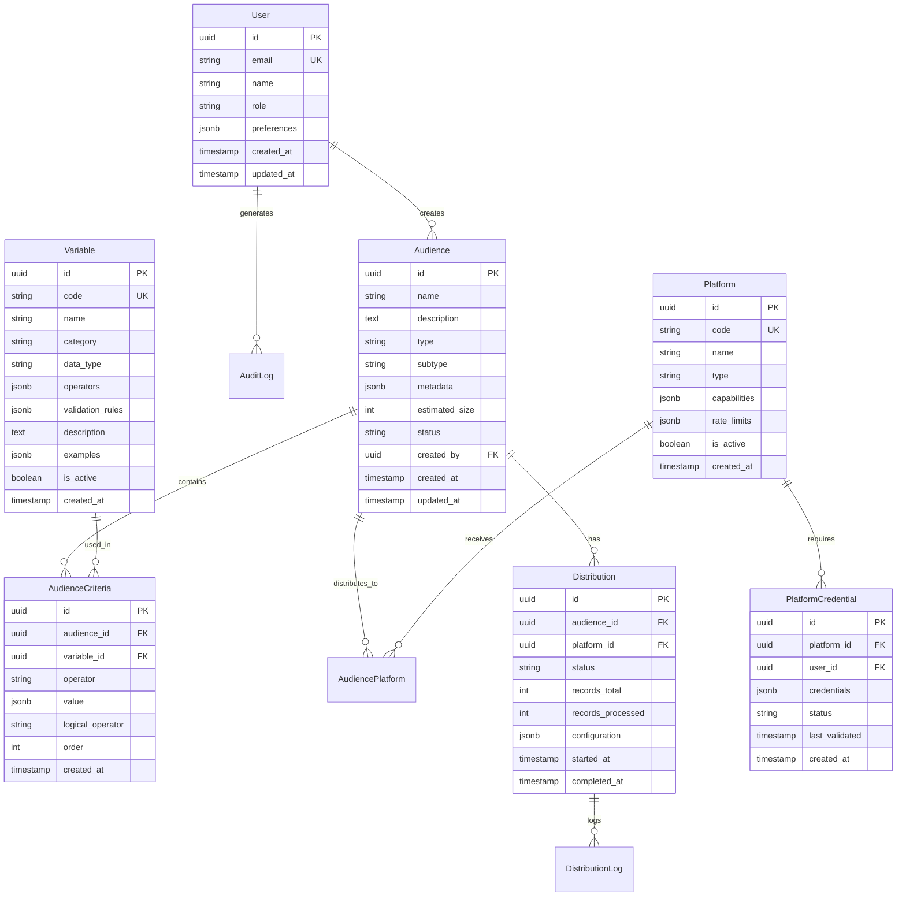

# Activation Manager - Implementation Guide (Part 2)

## Project Structure and Organization

### Monorepo Structure

```
activation-manager/
├── packages/
│   ├── frontend/                 # React application
│   │   ├── src/
│   │   │   ├── components/     # Reusable UI components
│   │   │   ├── pages/         # Route-level components
│   │   │   ├── hooks/         # Custom React hooks
│   │   │   ├── services/      # API service layer
│   │   │   ├── store/         # State management
│   │   │   ├── types/         # TypeScript definitions
│   │   │   ├── utils/         # Utility functions
│   │   │   └── config/        # Configuration files
│   │   ├── public/            # Static assets
│   │   └── package.json
│   │
│   ├── backend/                # Node.js API
│   │   ├── src/
│   │   │   ├── modules/       # Feature modules
│   │   │   ├── common/        # Shared code
│   │   │   ├── config/        # Configuration
│   │   │   ├── database/      # Database layer
│   │   │   ├── middleware/    # Express middleware
│   │   │   └── main.ts        # Application entry
│   │   ├── prisma/            # Database schema
│   │   └── package.json
│   │
│   ├── shared/                 # Shared types/utilities
│   │   ├── src/
│   │   │   ├── types/         # Common interfaces
│   │   │   ├── constants/     # Shared constants
│   │   │   └── utils/         # Shared utilities
│   │   └── package.json
│   │
│   └── infrastructure/         # Infrastructure as Code
│       ├── terraform/         # Terraform configs
│       ├── kubernetes/        # K8s manifests
│       └── docker/           # Docker files
│
├── docs/                      # Documentation
├── scripts/                   # Build/deploy scripts
├── .github/                   # GitHub workflows
├── package.json              # Root package.json
├── lerna.json               # Monorepo config
└── README.md
```

### Frontend Module Structure

```typescript
// packages/frontend/src/modules/audience/
audience/
├── components/
│   ├── AudienceBuilder/
│   │   ├── AudienceBuilder.tsx
│   │   ├── AudienceBuilder.test.tsx
│   │   ├── AudienceBuilder.stories.tsx
│   │   └── index.ts
│   ├── AudienceList/
│   ├── AudienceCriteria/
│   └── VariableSelector/
├── hooks/
│   ├── useAudiences.ts
│   ├── useAudienceBuilder.ts
│   └── useVariableMetadata.ts
├── services/
│   ├── audienceService.ts
│   └── variableService.ts
├── types/
│   ├── audience.types.ts
│   └── variable.types.ts
└── index.ts
```

### Backend Module Structure

```typescript
// packages/backend/src/modules/audience/
audience/
├── controllers/
│   ├── audience.controller.ts
│   └── audience.controller.test.ts
├── services/
│   ├── audience.service.ts
│   ├── audience.service.test.ts
│   └── audience-calculation.service.ts
├── repositories/
│   ├── audience.repository.ts
│   └── audience.repository.test.ts
├── dto/
│   ├── create-audience.dto.ts
│   ├── update-audience.dto.ts
│   └── audience-query.dto.ts
├── entities/
│   └── audience.entity.ts
├── audience.module.ts
└── index.ts
```

### Code Organization Principles

#### 1. Feature-First Organization
```typescript
// Group by feature, not by file type
// ✅ Good
modules/
  audience/
    components/
    services/
    hooks/
    
// ❌ Avoid
components/
  audience/
services/
  audience/
hooks/
  audience/
```

#### 2. Barrel Exports
```typescript
// modules/audience/index.ts
export * from './components';
export * from './hooks';
export * from './services';
export * from './types';

// Usage
import { AudienceBuilder, useAudiences } from '@/modules/audience';
```

#### 3. Dependency Management
```typescript
// Enforce dependency boundaries
// packages/frontend/src/modules/audience/services/audience.service.ts
import { httpClient } from '@/common/http';
import { AudienceDto } from '@shared/types';
// ✅ Can import from common and shared

// ❌ Cannot import from other modules directly
// import { PlatformService } from '@/modules/platform';
```

---

## Database Design and Schema

### Entity Relationship Diagram



### PostgreSQL Schema Implementation

```sql
-- Enable extensions
CREATE EXTENSION IF NOT EXISTS "uuid-ossp";
CREATE EXTENSION IF NOT EXISTS "pgcrypto";

-- Create enum types
CREATE TYPE audience_type AS ENUM ('1st-party', '3rd-party', 'clean-room');
CREATE TYPE audience_status AS ENUM ('draft', 'active', 'archived');
CREATE TYPE distribution_status AS ENUM ('pending', 'processing', 'completed', 'failed', 'cancelled');
CREATE TYPE platform_type AS ENUM ('social', 'search', 'display', 'video', 'retail');

-- Users table
CREATE TABLE users (
    id UUID PRIMARY KEY DEFAULT uuid_generate_v4(),
    email VARCHAR(255) UNIQUE NOT NULL,
    name VARCHAR(255) NOT NULL,
    role VARCHAR(50) NOT NULL DEFAULT 'user',
    preferences JSONB DEFAULT '{}',
    created_at TIMESTAMP WITH TIME ZONE DEFAULT CURRENT_TIMESTAMP,
    updated_at TIMESTAMP WITH TIME ZONE DEFAULT CURRENT_TIMESTAMP
);

-- Audiences table
CREATE TABLE audiences (
    id UUID PRIMARY KEY DEFAULT uuid_generate_v4(),
    name VARCHAR(255) NOT NULL,
    description TEXT,
    type audience_type NOT NULL,
    subtype VARCHAR(50) NOT NULL,
    metadata JSONB DEFAULT '{}',
    estimated_size INTEGER DEFAULT 0,
    status audience_status DEFAULT 'draft',
    created_by UUID REFERENCES users(id) ON DELETE SET NULL,
    created_at TIMESTAMP WITH TIME ZONE DEFAULT CURRENT_TIMESTAMP,
    updated_at TIMESTAMP WITH TIME ZONE DEFAULT CURRENT_TIMESTAMP,
    
    -- Indexes
    INDEX idx_audiences_created_by (created_by),
    INDEX idx_audiences_status (status),
    INDEX idx_audiences_type (type, subtype)
);

-- Variables table
CREATE TABLE variables (
    id UUID PRIMARY KEY DEFAULT uuid_generate_v4(),
    code VARCHAR(100) UNIQUE NOT NULL,
    name VARCHAR(255) NOT NULL,
    category VARCHAR(100) NOT NULL,
    data_type VARCHAR(50) NOT NULL,
    operators JSONB NOT NULL DEFAULT '[]',
    validation_rules JSONB DEFAULT '{}',
    description TEXT,
    examples JSONB DEFAULT '[]',
    is_active BOOLEAN DEFAULT true,
    created_at TIMESTAMP WITH TIME ZONE DEFAULT CURRENT_TIMESTAMP,
    
    -- Indexes
    INDEX idx_variables_category (category),
    INDEX idx_variables_active (is_active)
);

-- Audience criteria table
CREATE TABLE audience_criteria (
    id UUID PRIMARY KEY DEFAULT uuid_generate_v4(),
    audience_id UUID NOT NULL REFERENCES audiences(id) ON DELETE CASCADE,
    variable_id UUID NOT NULL REFERENCES variables(id),
    operator VARCHAR(50) NOT NULL,
    value JSONB NOT NULL,
    logical_operator VARCHAR(10) DEFAULT 'AND',
    "order" INTEGER NOT NULL DEFAULT 0,
    created_at TIMESTAMP WITH TIME ZONE DEFAULT CURRENT_TIMESTAMP,
    
    -- Indexes
    INDEX idx_criteria_audience (audience_id),
    INDEX idx_criteria_variable (variable_id)
);

-- Platforms table
CREATE TABLE platforms (
    id UUID PRIMARY KEY DEFAULT uuid_generate_v4(),
    code VARCHAR(50) UNIQUE NOT NULL,
    name VARCHAR(255) NOT NULL,
    type platform_type NOT NULL,
    capabilities JSONB DEFAULT '{}',
    rate_limits JSONB DEFAULT '{}',
    is_active BOOLEAN DEFAULT true,
    created_at TIMESTAMP WITH TIME ZONE DEFAULT CURRENT_TIMESTAMP
);

-- Platform credentials table
CREATE TABLE platform_credentials (
    id UUID PRIMARY KEY DEFAULT uuid_generate_v4(),
    platform_id UUID NOT NULL REFERENCES platforms(id),
    user_id UUID NOT NULL REFERENCES users(id),
    -- Encrypted credentials storage
    credentials BYTEA NOT NULL,
    credentials_iv BYTEA NOT NULL,
    status VARCHAR(50) DEFAULT 'pending',
    last_validated TIMESTAMP WITH TIME ZONE,
    created_at TIMESTAMP WITH TIME ZONE DEFAULT CURRENT_TIMESTAMP,
    updated_at TIMESTAMP WITH TIME ZONE DEFAULT CURRENT_TIMESTAMP,
    
    -- Unique constraint
    UNIQUE(platform_id, user_id),
    
    -- Indexes
    INDEX idx_credentials_user (user_id),
    INDEX idx_credentials_platform (platform_id)
);

-- Distributions table
CREATE TABLE distributions (
    id UUID PRIMARY KEY DEFAULT uuid_generate_v4(),
    audience_id UUID NOT NULL REFERENCES audiences(id),
    platform_id UUID NOT NULL REFERENCES platforms(id),
    status distribution_status DEFAULT 'pending',
    records_total INTEGER DEFAULT 0,
    records_processed INTEGER DEFAULT 0,
    records_matched INTEGER DEFAULT 0,
    configuration JSONB DEFAULT '{}',
    error_details JSONB,
    started_at TIMESTAMP WITH TIME ZONE,
    completed_at TIMESTAMP WITH TIME ZONE,
    created_at TIMESTAMP WITH TIME ZONE DEFAULT CURRENT_TIMESTAMP,
    
    -- Indexes
    INDEX idx_distributions_audience (audience_id),
    INDEX idx_distributions_platform (platform_id),
    INDEX idx_distributions_status (status),
    INDEX idx_distributions_created (created_at DESC)
);

-- Distribution logs table (for detailed tracking)
CREATE TABLE distribution_logs (
    id UUID PRIMARY KEY DEFAULT uuid_generate_v4(),
    distribution_id UUID NOT NULL REFERENCES distributions(id) ON DELETE CASCADE,
    level VARCHAR(20) NOT NULL,
    message TEXT NOT NULL,
    details JSONB,
    created_at TIMESTAMP WITH TIME ZONE DEFAULT CURRENT_TIMESTAMP,
    
    -- Indexes
    INDEX idx_logs_distribution (distribution_id),
    INDEX idx_logs_created (created_at DESC)
);

-- Audit log table
CREATE TABLE audit_logs (
    id UUID PRIMARY KEY DEFAULT uuid_generate_v4(),
    user_id UUID REFERENCES users(id),
    entity_type VARCHAR(50) NOT NULL,
    entity_id UUID NOT NULL,
    action VARCHAR(50) NOT NULL,
    changes JSONB,
    ip_address INET,
    user_agent TEXT,
    created_at TIMESTAMP WITH TIME ZONE DEFAULT CURRENT_TIMESTAMP,
    
    -- Indexes
    INDEX idx_audit_user (user_id),
    INDEX idx_audit_entity (entity_type, entity_id),
    INDEX idx_audit_created (created_at DESC)
);

-- Create update timestamp trigger
CREATE OR REPLACE FUNCTION update_updated_at_column()
RETURNS TRIGGER AS $$
BEGIN
    NEW.updated_at = CURRENT_TIMESTAMP;
    RETURN NEW;
END;
$$ language 'plpgsql';

-- Apply trigger to tables with updated_at
CREATE TRIGGER update_users_updated_at BEFORE UPDATE ON users
    FOR EACH ROW EXECUTE FUNCTION update_updated_at_column();
    
CREATE TRIGGER update_audiences_updated_at BEFORE UPDATE ON audiences
    FOR EACH ROW EXECUTE FUNCTION update_updated_at_column();
    
CREATE TRIGGER update_credentials_updated_at BEFORE UPDATE ON platform_credentials
    FOR EACH ROW EXECUTE FUNCTION update_updated_at_column();
```

### Prisma Schema Definition

```prisma
// prisma/schema.prisma
generator client {
  provider = "prisma-client-js"
}

datasource db {
  provider = "postgresql"
  url      = env("DATABASE_URL")
}

enum AudienceType {
  FIRST_PARTY @map("1st-party")
  THIRD_PARTY @map("3rd-party")
  CLEAN_ROOM  @map("clean-room")
}

enum AudienceStatus {
  DRAFT
  ACTIVE
  ARCHIVED
}

enum DistributionStatus {
  PENDING
  PROCESSING
  COMPLETED
  FAILED
  CANCELLED
}

model User {
  id               String              @id @default(uuid())
  email            String              @unique
  name             String
  role             String              @default("user")
  preferences      Json                @default("{}")
  createdAt        DateTime            @default(now())
  updatedAt        DateTime            @updatedAt
  
  audiences        Audience[]
  credentials      PlatformCredential[]
  auditLogs        AuditLog[]
  
  @@map("users")
}

model Audience {
  id              String            @id @default(uuid())
  name            String
  description     String?
  type            AudienceType
  subtype         String
  metadata        Json              @default("{}")
  estimatedSize   Int               @default(0)
  status          AudienceStatus    @default(DRAFT)
  createdBy       String?
  createdAt       DateTime          @default(now())
  updatedAt       DateTime          @updatedAt
  
  creator         User?             @relation(fields: [createdBy], references: [id])
  criteria        AudienceCriteria[]
  distributions   Distribution[]
  platforms       AudiencePlatform[]
  
  @@index([createdBy])
  @@index([status])
  @@index([type, subtype])
  @@map("audiences")
}

model Variable {
  id              String            @id @default(uuid())
  code            String            @unique
  name            String
  category        String
  dataType        String
  operators       Json              @default("[]")
  validationRules Json              @default("{}")
  description     String?
  examples        Json              @default("[]")
  isActive        Boolean           @default(true)
  createdAt       DateTime          @default(now())
  
  criteria        AudienceCriteria[]
  
  @@index([category])
  @@index([isActive])
  @@map("variables")
}

model AudienceCriteria {
  id              String    @id @default(uuid())
  audienceId      String
  variableId      String
  operator        String
  value           Json
  logicalOperator String    @default("AND")
  order           Int       @default(0)
  createdAt       DateTime  @default(now())
  
  audience        Audience  @relation(fields: [audienceId], references: [id], onDelete: Cascade)
  variable        Variable  @relation(fields: [variableId], references: [id])
  
  @@index([audienceId])
  @@index([variableId])
  @@map("audience_criteria")
}

model Platform {
  id              String              @id @default(uuid())
  code            String              @unique
  name            String
  type            String
  capabilities    Json                @default("{}")
  rateLimits      Json                @default("{}")
  isActive        Boolean             @default(true)
  createdAt       DateTime            @default(now())
  
  credentials     PlatformCredential[]
  distributions   Distribution[]
  audiences       AudiencePlatform[]
  
  @@map("platforms")
}

model PlatformCredential {
  id              String    @id @default(uuid())
  platformId      String
  userId          String
  credentials     Bytes     // Encrypted
  credentialsIv   Bytes
  status          String    @default("pending")
  lastValidated   DateTime?
  createdAt       DateTime  @default(now())
  updatedAt       DateTime  @updatedAt
  
  platform        Platform  @relation(fields: [platformId], references: [id])
  user            User      @relation(fields: [userId], references: [id])
  
  @@unique([platformId, userId])
  @@index([userId])
  @@index([platformId])
  @@map("platform_credentials")
}

model Distribution {
  id               String              @id @default(uuid())
  audienceId       String
  platformId       String
  status           DistributionStatus  @default(PENDING)
  recordsTotal     Int                 @default(0)
  recordsProcessed Int                 @default(0)
  recordsMatched   Int                 @default(0)
  configuration    Json                @default("{}")
  errorDetails     Json?
  startedAt        DateTime?
  completedAt      DateTime?
  createdAt        DateTime            @default(now())
  
  audience         Audience            @relation(fields: [audienceId], references: [id])
  platform         Platform            @relation(fields: [platformId], references: [id])
  logs             DistributionLog[]
  
  @@index([audienceId])
  @@index([platformId])
  @@index([status])
  @@index([createdAt(sort: Desc)])
  @@map("distributions")
}

model DistributionLog {
  id              String        @id @default(uuid())
  distributionId  String
  level           String
  message         String
  details         Json?
  createdAt       DateTime      @default(now())
  
  distribution    Distribution  @relation(fields: [distributionId], references: [id], onDelete: Cascade)
  
  @@index([distributionId])
  @@index([createdAt(sort: Desc)])
  @@map("distribution_logs")
}

model AuditLog {
  id              String    @id @default(uuid())
  userId          String?
  entityType      String
  entityId        String
  action          String
  changes         Json?
  ipAddress       String?
  userAgent       String?
  createdAt       DateTime  @default(now())
  
  user            User?     @relation(fields: [userId], references: [id])
  
  @@index([userId])
  @@index([entityType, entityId])
  @@index([createdAt(sort: Desc)])
  @@map("audit_logs")
}

// Junction table for many-to-many relationship
model AudiencePlatform {
  id              String    @id @default(uuid())
  audienceId      String
  platformId      String
  syncedAt        DateTime?
  matchRate       Float?
  
  audience        Audience  @relation(fields: [audienceId], references: [id])
  platform        Platform  @relation(fields: [platformId], references: [id])
  
  @@unique([audienceId, platformId])
  @@map("audience_platforms")
}
```

### Database Optimization Strategies

#### 1. Indexing Strategy
```sql
-- Composite indexes for common queries
CREATE INDEX idx_audiences_search ON audiences 
  USING gin(to_tsvector('english', name || ' ' || COALESCE(description, '')));

CREATE INDEX idx_distributions_date_range ON distributions (created_at DESC)
  WHERE status IN ('completed', 'failed');

-- Partial indexes for performance
CREATE INDEX idx_active_audiences ON audiences (created_at DESC)
  WHERE status = 'active';

CREATE INDEX idx_pending_distributions ON distributions (created_at)
  WHERE status = 'pending';
```

#### 2. Partitioning Strategy
```sql
-- Partition distribution_logs by month
CREATE TABLE distribution_logs_2024_01 PARTITION OF distribution_logs
  FOR VALUES FROM ('2024-01-01') TO ('2024-02-01');

CREATE TABLE distribution_logs_2024_02 PARTITION OF distribution_logs
  FOR VALUES FROM ('2024-02-01') TO ('2024-03-01');

-- Automated partition creation
CREATE OR REPLACE FUNCTION create_monthly_partition()
RETURNS void AS $$
DECLARE
  start_date date;
  end_date date;
  partition_name text;
BEGIN
  start_date := date_trunc('month', CURRENT_DATE);
  end_date := start_date + interval '1 month';
  partition_name := 'distribution_logs_' || to_char(start_date, 'YYYY_MM');
  
  EXECUTE format(
    'CREATE TABLE IF NOT EXISTS %I PARTITION OF distribution_logs
     FOR VALUES FROM (%L) TO (%L)',
    partition_name, start_date, end_date
  );
END;
$$ LANGUAGE plpgsql;
```

#### 3. Query Optimization
```typescript
// Efficient audience query with criteria
const getAudienceWithCriteria = async (audienceId: string) => {
  return prisma.audience.findUnique({
    where: { id: audienceId },
    include: {
      criteria: {
        include: {
          variable: true
        },
        orderBy: {
          order: 'asc'
        }
      },
      creator: {
        select: {
          id: true,
          name: true,
          email: true
        }
      },
      _count: {
        select: {
          distributions: true
        }
      }
    }
  });
};
```

---

## API Architecture and Design

### RESTful API Design

#### API Structure
```
/api/v1
├── /auth
│   ├── POST   /login
│   ├── POST   /logout
│   ├── POST   /refresh
│   └── GET    /me
├── /audiences
│   ├── GET    /                 # List audiences
│   ├── POST   /                 # Create audience
│   ├── GET    /:id              # Get audience
│   ├── PUT    /:id              # Update audience
│   ├── DELETE /:id              # Delete audience
│   ├── POST   /:id/duplicate    # Duplicate audience
│   ├── POST   /:id/calculate    # Calculate size
│   └── GET    /:id/preview      # Preview records
├── /variables
│   ├── GET    /                 # List variables
│   ├── GET    /:id              # Get variable
│   └── GET    /categories       # Get categories
├── /platforms
│   ├── GET    /                 # List platforms
│   ├── GET    /:id              # Get platform
│   ├── POST   /:id/connect      # Connect platform
│   ├── POST   /:id/disconnect   # Disconnect platform
│   └── POST   /:id/validate     # Validate credentials
├── /distributions
│   ├── GET    /                 # List distributions
│   ├── POST   /                 # Create distribution
│   ├── GET    /:id              # Get distribution
│   ├── POST   /:id/cancel       # Cancel distribution
│   └── GET    /:id/logs         # Get logs
└── /analytics
    ├── GET    /dashboard        # Dashboard metrics
    ├── GET    /audiences/:id    # Audience analytics
    └── GET    /platforms/:id    # Platform analytics
```

### API Implementation

#### 1. Base Controller Class
```typescript
// src/common/base.controller.ts
import { Request, Response, NextFunction } from 'express';
import { ValidationError } from '@/common/errors';
import { Logger } from '@/common/logger';

export abstract class BaseController {
  protected logger: Logger;

  constructor(name: string) {
    this.logger = new Logger(name);
  }

  protected async execute(
    req: Request,
    res: Response,
    next: NextFunction,
    fn: () => Promise<any>
  ): Promise<void> {
    try {
      const result = await fn();
      this.success(res, result);
    } catch (error) {
      next(error);
    }
  }

  protected success<T>(res: Response, data?: T, message?: string): void {
    res.json({
      success: true,
      message: message || 'Success',
      data,
    });
  }

  protected created<T>(res: Response, data: T, location?: string): void {
    if (location) {
      res.setHeader('Location', location);
    }
    res.status(201).json({
      success: true,
      message: 'Created successfully',
      data,
    });
  }

  protected noContent(res: Response): void {
    res.status(204).send();
  }

  protected paginated<T>(
    res: Response,
    data: T[],
    pagination: PaginationMeta
  ): void {
    res.json({
      success: true,
      data,
      meta: pagination,
    });
  }
}

interface PaginationMeta {
  page: number;
  pageSize: number;
  total: number;
  totalPages: number;
  hasNext: boolean;
  hasPrevious: boolean;
}
```

#### 2. Audience Controller
```typescript
// src/modules/audience/controllers/audience.controller.ts
import { Request, Response, NextFunction } from 'express';
import { inject, injectable } from 'inversify';
import { BaseController } from '@/common/base.controller';
import { AudienceService } from '../services/audience.service';
import { CreateAudienceDto, UpdateAudienceDto } from '../dto';
import { validateDto } from '@/common/validators';
import { requireAuth, requireRole } from '@/common/guards';

@injectable()
export class AudienceController extends BaseController {
  constructor(
    @inject(AudienceService) private audienceService: AudienceService
  ) {
    super('AudienceController');
  }

  @requireAuth()
  async list(req: Request, res: Response, next: NextFunction): Promise<void> {
    await this.execute(req, res, next, async () => {
      const { page = 1, pageSize = 20, ...filters } = req.query;
      
      const result = await this.audienceService.findAll({
        page: Number(page),
        pageSize: Number(pageSize),
        filters,
        userId: req.user!.id,
      });

      return this.paginated(res, result.data, result.meta);
    });
  }

  @requireAuth()
  async create(req: Request, res: Response, next: NextFunction): Promise<void> {
    await this.execute(req, res, next, async () => {
      const dto = await validateDto(CreateAudienceDto, req.body);
      
      const audience = await this.audienceService.create({
        ...dto,
        createdBy: req.user!.id,
      });

      return this.created(res, audience, `/api/v1/audiences/${audience.id}`);
    });
  }

  @requireAuth()
  async findOne(req: Request, res: Response, next: NextFunction): Promise<void> {
    await this.execute(req, res, next, async () => {
      const audience = await this.audienceService.findOne(
        req.params.id,
        req.user!.id
      );

      return audience;
    });
  }

  @requireAuth()
  async update(req: Request, res: Response, next: NextFunction): Promise<void> {
    await this.execute(req, res, next, async () => {
      const dto = await validateDto(UpdateAudienceDto, req.body);
      
      const audience = await this.audienceService.update(
        req.params.id,
        dto,
        req.user!.id
      );

      return audience;
    });
  }

  @requireAuth()
  async delete(req: Request, res: Response, next: NextFunction): Promise<void> {
    await this.execute(req, res, next, async () => {
      await this.audienceService.delete(req.params.id, req.user!.id);
      return this.noContent(res);
    });
  }

  @requireAuth()
  async calculateSize(req: Request, res: Response, next: NextFunction): Promise<void> {
    await this.execute(req, res, next, async () => {
      const size = await this.audienceService.calculateSize(
        req.params.id,
        req.user!.id
      );

      return { estimatedSize: size };
    });
  }

  @requireAuth()
  async duplicate(req: Request, res: Response, next: NextFunction): Promise<void> {
    await this.execute(req, res, next, async () => {
      const { name } = req.body;
      
      const audience = await this.audienceService.duplicate(
        req.params.id,
        name,
        req.user!.id
      );

      return this.created(res, audience, `/api/v1/audiences/${audience.id}`);
    });
  }
}
```

#### 3. Service Layer Implementation
```typescript
// src/modules/audience/services/audience.service.ts
import { inject, injectable } from 'inversify';
import { PrismaClient } from '@prisma/client';
import { AudienceRepository } from '../repositories/audience.repository';
import { VariableService } from '@/modules/variable/services/variable.service';
import { CacheService } from '@/common/cache/cache.service';
import { EventBus } from '@/common/events/event-bus';
import { 
  CreateAudienceDto, 
  UpdateAudienceDto, 
  AudienceQueryDto 
} from '../dto';
import { 
  AudienceNotFoundException, 
  UnauthorizedException 
} from '@/common/errors';

@injectable()
export class AudienceService {
  constructor(
    @inject(AudienceRepository) private audienceRepo: AudienceRepository,
    @inject(VariableService) private variableService: VariableService,
    @inject(CacheService) private cache: CacheService,
    @inject(EventBus) private eventBus: EventBus
  ) {}

  async findAll(query: AudienceQueryDto) {
    const cacheKey = `audiences:${JSON.stringify(query)}`;
    
    // Try cache first
    const cached = await this.cache.get(cacheKey);
    if (cached) return cached;

    // Query database
    const result = await this.audienceRepo.findAll(query);

    // Cache for 5 minutes
    await this.cache.set(cacheKey, result, 300);

    return result;
  }

  async findOne(id: string, userId: string) {
    const audience = await this.audienceRepo.findById(id);
    
    if (!audience) {
      throw new AudienceNotFoundException(id);
    }

    // Check access permissions
    if (audience.createdBy !== userId) {
      throw new UnauthorizedException('Access denied to this audience');
    }

    return audience;
  }

  async create(dto: CreateAudienceDto & { createdBy: string }) {
    // Validate criteria variables
    await this.validateCriteria(dto.criteria);

    // Calculate initial size estimate
    const estimatedSize = await this.calculateSizeFromCriteria(dto.criteria);

    // Create audience
    const audience = await this.audienceRepo.create({
      ...dto,
      estimatedSize,
      status: 'draft',
    });

    // Publish event
    await this.eventBus.publish({
      type: 'audience.created',
      payload: {
        audienceId: audience.id,
        userId: dto.createdBy,
      },
    });

    // Invalidate cache
    await this.cache.invalidate('audiences:*');

    return audience;
  }

  async update(id: string, dto: UpdateAudienceDto, userId: string) {
    // Verify ownership
    await this.findOne(id, userId);

    // Validate criteria if updated
    if (dto.criteria) {
      await this.validateCriteria(dto.criteria);
      dto.estimatedSize = await this.calculateSizeFromCriteria(dto.criteria);
    }

    // Update audience
    const audience = await this.audienceRepo.update(id, dto);

    // Publish event
    await this.eventBus.publish({
      type: 'audience.updated',
      payload: {
        audienceId: id,
        userId,
        changes: dto,
      },
    });

    // Invalidate cache
    await this.cache.invalidate(`audiences:*`);
    await this.cache.invalidate(`audience:${id}`);

    return audience;
  }

  async delete(id: string, userId: string) {
    // Verify ownership
    await this.findOne(id, userId);

    // Soft delete
    await this.audienceRepo.update(id, { status: 'archived' });

    // Publish event
    await this.eventBus.publish({
      type: 'audience.deleted',
      payload: {
        audienceId: id,
        userId,
      },
    });

    // Invalidate cache
    await this.cache.invalidate(`audiences:*`);
    await this.cache.invalidate(`audience:${id}`);
  }

  async calculateSize(id: string, userId: string) {
    const audience = await this.findOne(id, userId);
    
    // Use cached size if recent
    const cacheKey = `audience-size:${id}`;
    const cachedSize = await this.cache.get<number>(cacheKey);
    if (cachedSize !== null) return cachedSize;

    // Calculate new size
    const size = await this.calculateSizeFromCriteria(audience.criteria);

    // Cache for 1 hour
    await this.cache.set(cacheKey, size, 3600);

    // Update database
    await this.audienceRepo.update(id, { estimatedSize: size });

    return size;
  }

  private async validateCriteria(criteria: any[]) {
    for (const criterion of criteria) {
      const variable = await this.variableService.findById(criterion.variableId);
      
      if (!variable || !variable.isActive) {
        throw new Error(`Invalid variable: ${criterion.variableId}`);
      }

      // Validate operator is allowed for variable
      if (!variable.operators.includes(criterion.operator)) {
        throw new Error(
          `Operator ${criterion.operator} not allowed for variable ${variable.name}`
        );
      }

      // Validate value based on data type
      this.validateValue(criterion.value, variable.dataType, variable.validationRules);
    }
  }

  private validateValue(value: any, dataType: string, rules: any) {
    // Implementation of value validation based on data type and rules
    switch (dataType) {
      case 'number':
        if (typeof value !== 'number') {
          throw new Error('Value must be a number');
        }
        if (rules.min !== undefined && value < rules.min) {
          throw new Error(`Value must be at least ${rules.min}`);
        }
        if (rules.max !== undefined && value > rules.max) {
          throw new Error(`Value must be at most ${rules.max}`);
        }
        break;
      
      case 'string':
        if (typeof value !== 'string') {
          throw new Error('Value must be a string');
        }
        if (rules.pattern) {
          const regex = new RegExp(rules.pattern);
          if (!regex.test(value)) {
            throw new Error('Value does not match required pattern');
          }
        }
        break;
      
      case 'array':
        if (!Array.isArray(value)) {
          throw new Error('Value must be an array');
        }
        if (rules.minItems !== undefined && value.length < rules.minItems) {
          throw new Error(`Array must have at least ${rules.minItems} items`);
        }
        break;
    }
  }

  private async calculateSizeFromCriteria(criteria: any[]): Promise<number> {
    // Simplified calculation - in production, this would query actual data
    let baseSize = 1000000; // 1M base audience
    let reduction = 1;

    for (const criterion of criteria) {
      const variable = await this.variableService.findById(criterion.variableId);
      
      // Apply reduction factors based on variable type
      switch (variable.category) {
        case 'Demographics':
          reduction *= 0.8;
          break;
        case 'Behavioral':
          reduction *= 0.6;
          break;
        case 'Transactional':
          reduction *= 0.5;
          break;
        default:
          reduction *= 0.7;
      }
    }

    return Math.floor(baseSize * reduction);
  }
}
```

### API Security Implementation

#### 1. Authentication Middleware
```typescript
// src/middleware/auth.middleware.ts
import { Request, Response, NextFunction } from 'express';
import jwt from 'jsonwebtoken';
import { UserService } from '@/modules/user/services/user.service';
import { UnauthorizedException } from '@/common/errors';

export interface AuthRequest extends Request {
  user?: {
    id: string;
    email: string;
    role: string;
  };
}

export const authMiddleware = (userService: UserService) => {
  return async (req: AuthRequest, res: Response, next: NextFunction) => {
    try {
      const token = extractToken(req);
      
      if (!token) {
        throw new UnauthorizedException('No token provided');
      }

      const decoded = jwt.verify(token, process.env.JWT_SECRET!) as any;
      const user = await userService.findById(decoded.userId);

      if (!user) {
        throw new UnauthorizedException('Invalid token');
      }

      req.user = {
        id: user.id,
        email: user.email,
        role: user.role,
      };

      next();
    } catch (error) {
      if (error instanceof jwt.JsonWebTokenError) {
        next(new UnauthorizedException('Invalid token'));
      } else {
        next(error);
      }
    }
  };
};

function extractToken(req: Request): string | null {
  // Check Authorization header
  const authHeader = req.headers.authorization;
  if (authHeader && authHeader.startsWith('Bearer ')) {
    return authHeader.substring(7);
  }

  // Check cookie
  if (req.cookies && req.cookies.token) {
    return req.cookies.token;
  }

  return null;
}
```

#### 2. Rate Limiting
```typescript
// src/middleware/rate-limit.middleware.ts
import rateLimit from 'express-rate-limit';
import RedisStore from 'rate-limit-redis';
import { redis } from '@/common/redis';

export const createRateLimiter = (options: {
  windowMs: number;
  max: number;
  message?: string;
}) => {
  return rateLimit({
    store: new RedisStore({
      client: redis,
      prefix: 'rate-limit:',
    }),
    windowMs: options.windowMs,
    max: options.max,
    message: options.message || 'Too many requests',
    standardHeaders: true,
    legacyHeaders: false,
  });
};

// Different rate limits for different endpoints
export const apiRateLimiter = createRateLimiter({
  windowMs: 60 * 1000, // 1 minute
  max: 100,
});

export const authRateLimiter = createRateLimiter({
  windowMs: 15 * 60 * 1000, // 15 minutes
  max: 5,
  message: 'Too many login attempts',
});

export const writeRateLimiter = createRateLimiter({
  windowMs: 60 * 1000, // 1 minute
  max: 20,
});
```

#### 3. Input Validation
```typescript
// src/common/validators/dto.validator.ts
import { plainToInstance } from 'class-transformer';
import { validate } from 'class-validator';
import { ValidationException } from '@/common/errors';

export async function validateDto<T extends object>(
  dtoClass: new () => T,
  data: any
): Promise<T> {
  const dto = plainToInstance(dtoClass, data);
  const errors = await validate(dto);

  if (errors.length > 0) {
    const messages = errors.map(error => {
      const constraints = Object.values(error.constraints || {});
      return {
        field: error.property,
        messages: constraints,
      };
    });

    throw new ValidationException('Validation failed', messages);
  }

  return dto;
}

// Example DTO with validation
import { IsString, IsEnum, IsArray, ValidateNested, IsOptional } from 'class-validator';
import { Type } from 'class-transformer';

export class CreateAudienceDto {
  @IsString()
  @Length(1, 255)
  name: string;

  @IsString()
  @IsOptional()
  @Length(0, 1000)
  description?: string;

  @IsEnum(AudienceType)
  type: AudienceType;

  @IsString()
  subtype: string;

  @IsArray()
  @ValidateNested({ each: true })
  @Type(() => CreateCriteriaDto)
  criteria: CreateCriteriaDto[];
}
```

This completes Part 2 of the implementation guide, covering project structure, database design, and API architecture. The guide continues with detailed implementation of specific features and integration strategies.