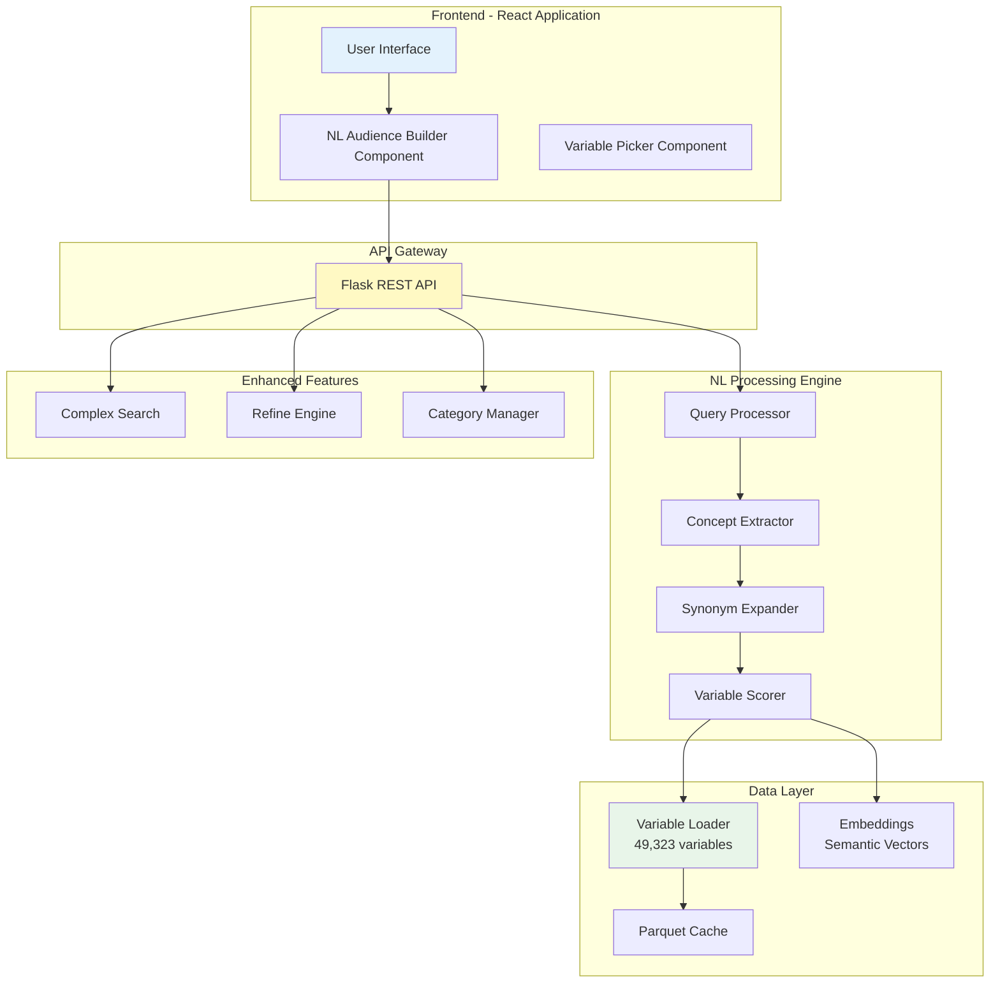
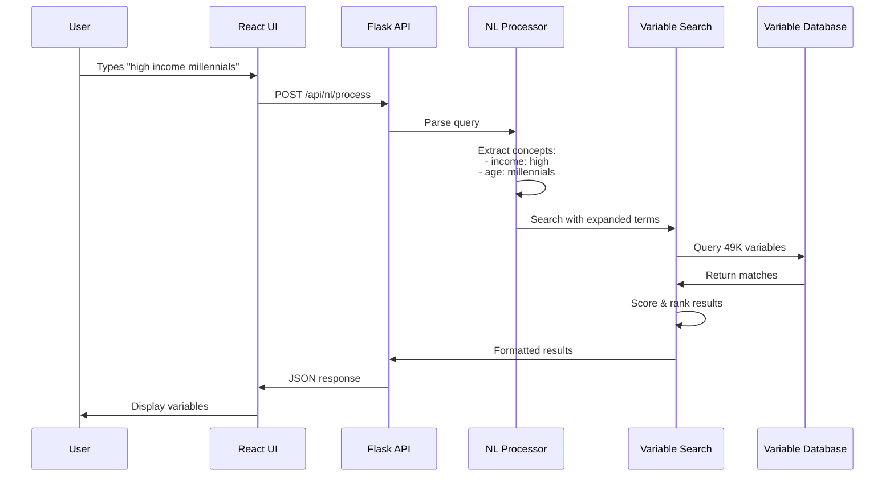
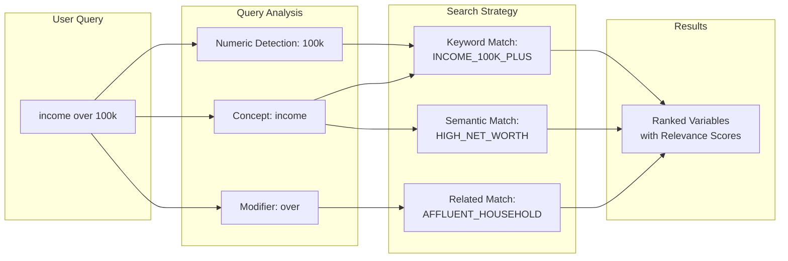
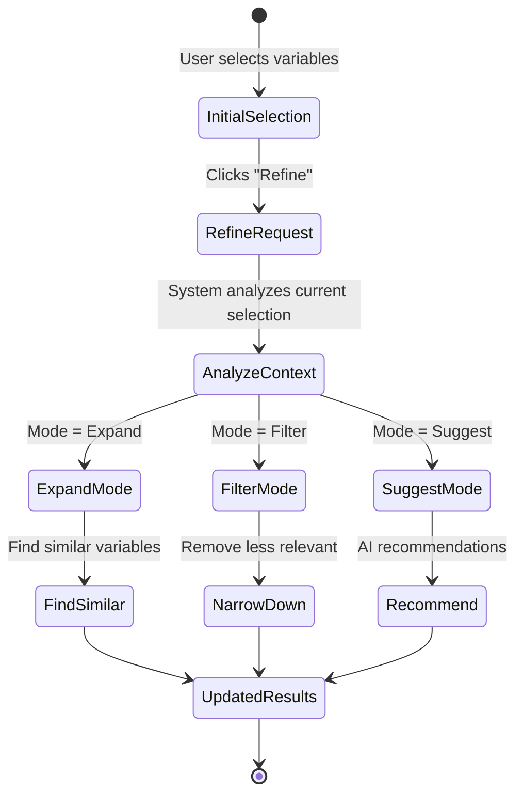
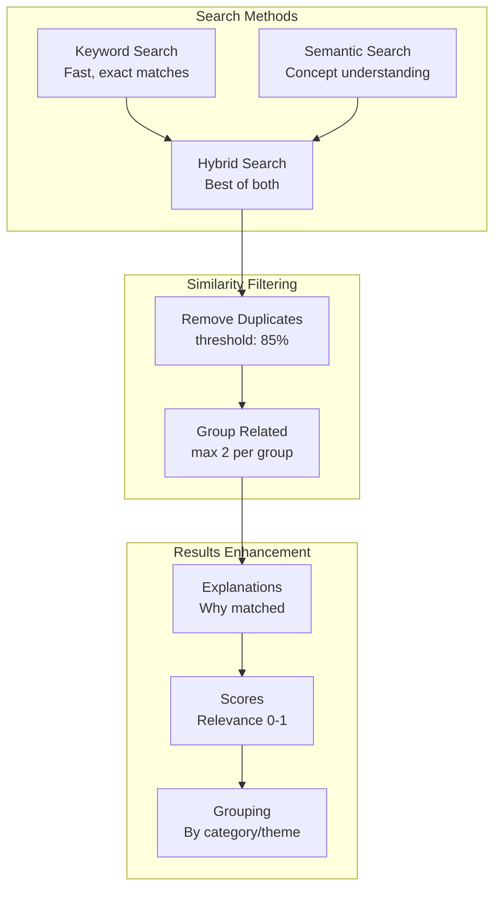

# Natural Language Architecture - Technical Flow

## System Architecture Overview



## Detailed Component Flow

### 1. Natural Language Query Processing



### 2. Enhanced Variable Picker Flow



### 3. Variable Refine Process



## Key Components Explained

### Query Processor (`/api/nl/process`)
- **Input**: Natural language text
- **Process**: 
  - Tokenization
  - Concept extraction
  - Intent classification
- **Output**: Structured query object

### Concept Extractor
```python
Concepts Identified:
- Demographics: age, gender, location
- Financial: income, wealth, spending
- Behavioral: interests, activities, purchases
- Psychographic: attitudes, values, lifestyle
```

### Variable Scoring Algorithm
```
Score = (
    Keyword Match Weight × 0.4 +
    Concept Coverage × 0.3 +
    Semantic Similarity × 0.2 +
    Context Relevance × 0.1
)
```

### Enhanced Search Features



## Data Flow Architecture

```mermaid
graph TD
    subgraph "Data Sources"
        PF[Parquet File<br/>49,323 variables]
        MD[Metadata<br/>Categories, themes]
        EM[Embeddings<br/>Semantic vectors]
    end
    
    subgraph "Memory Cache"
        SC[Shared Cache<br/>30min TTL]
        DF[DataFrame<br/>In-memory]
    end
    
    subgraph "API Endpoints"
        E1[/api/variable-picker/search]
        E2[/api/variable-picker/categories]
        E3[/api/variable-picker/refine]
        E4[/api/nl/process]
    end
    
    PF --> SC
    MD --> SC
    EM --> SC
    SC --> DF
    DF --> E1
    DF --> E2
    DF --> E3
    DF --> E4
```

## Performance Optimizations

1. **Lazy Loading**: Enhanced picker only loads when needed
2. **Shared Cache**: Reduces memory usage across workers
3. **DataFrame Operations**: Fast pandas queries
4. **Pre-computed Indexes**: Lower-case columns for search

## API Response Structure

```json
{
  "results": [...],
  "query_context": {
    "original_query": "high income millennials",
    "concepts": ["income", "age"],
    "expanded_terms": ["affluent", "wealthy", "25-40"]
  },
  "search_methods": {
    "keyword": true,
    "semantic": true
  },
  "total_found": 25
}
```