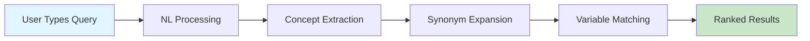
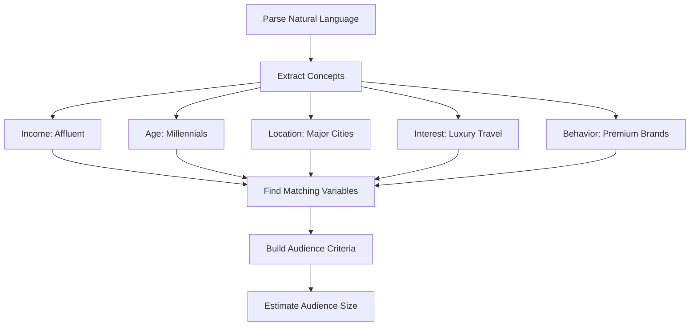
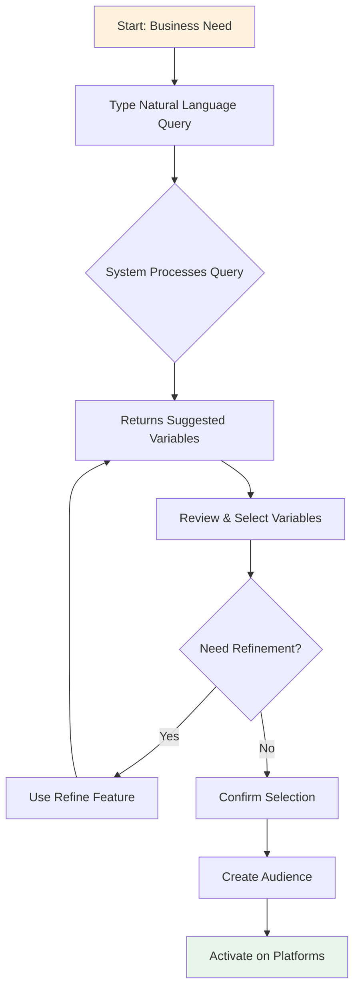

# Natural Language Features in Activation Manager
## Business User Guide

### Executive Summary

The Activation Manager incorporates advanced Natural Language (NL) processing capabilities that allow business users to build audiences using plain English queries instead of technical variable codes. This dramatically simplifies the audience creation process and makes the platform accessible to non-technical users.

---

## 🎯 Key Business Benefits

1. **Ease of Use**: Type queries in plain English like "high income millennials who love technology"
2. **Faster Audience Creation**: Build complex audiences in minutes instead of hours
3. **Better Discovery**: Find relevant variables you didn't know existed
4. **Reduced Training Time**: New users can be productive immediately
5. **Higher Accuracy**: AI understands context and suggests related variables

---

## 🔍 How Natural Language Search Works

### Simple Example
When a user types: **"young gamers with disposable income"**

The system:
1. **Understands Intent**: Identifies key concepts (age, gaming interest, income level)
2. **Expands Search**: Includes synonyms (youth, video games, high income)
3. **Finds Variables**: Matches to actual data variables in our 49,000+ variable catalog
4. **Ranks Results**: Shows most relevant variables first with explanation

### Visual Flow Diagram



---

## 🛠️ Natural Language Features

### 1. **Smart Variable Search**
Transform natural language into precise variable selections.

**Example Queries:**
- "millennials interested in sustainable products" 
- "high net worth individuals who travel frequently"
- "parents with young children in urban areas"

**What Happens Behind the Scenes:**
```
User Query: "millennials interested in sustainable products"
                            ↓
System Identifies:
- Age concept: millennials → AGE_25_40
- Interest concept: sustainable → ENV_CONSCIOUS, GREEN_SHOPPER
- Product behavior: products → PURCHASE_ECO_FRIENDLY
                            ↓
Returns: Ranked list of matching variables with relevance scores
```

### 2. **Intelligent Query Understanding**

The system understands various ways of expressing the same concept:

| User Says | System Understands |
|-----------|-------------------|
| "high income" | Income $100K+, affluent, wealthy, high net worth |
| "young adults" | Age 18-34, millennials, Gen Z |
| "tech savvy" | Digital natives, online shoppers, early adopters |
| "urban" | City dwellers, metropolitan, downtown residents |

### 3. **Context-Aware Suggestions**

The system provides different results based on context:

**Query: "green"**
- In context of shopping → ECO_FRIENDLY_SHOPPER
- In context of politics → ENVIRONMENTAL_VOTER  
- In context of energy → RENEWABLE_ENERGY_USER

### 4. **Natural Language Audience Builder**

Users can describe their entire audience in one sentence:

**Input:** "I want to find affluent millennials in major cities who are interested in luxury travel and premium brands"

**System Process:**


---

## 📊 Business Use Cases

### Marketing Campaign Planning

**Scenario:** Launch a new premium fitness app

**Traditional Approach:**
- Manually browse through thousands of variables
- Guess which codes might be relevant
- Time required: 2-3 hours

**NL Approach:**
- Type: "health conscious millennials with high income who use fitness apps"
- Review suggested variables
- Time required: 5 minutes

### Customer Segmentation

**Scenario:** Identify eco-conscious consumers

**Query Examples:**
- "environmentally conscious shoppers who buy organic"
- "people who care about sustainability and climate change"
- "green consumers who recycle and use renewable energy"

Each query returns different but relevant variable combinations.

### Market Expansion

**Scenario:** Find new audience segments

**Refine Feature:** Start with core audience, then expand
1. Initial: "luxury car owners"
2. Refine: "Find similar audiences"
3. System suggests: "high income professionals", "premium credit card holders", "frequent business travelers"

---

## 🔄 The Complete Audience Building Workflow



---

## 💡 Tips for Best Results

### Do's ✅
- Use descriptive language: "young urban professionals who commute by public transit"
- Include multiple attributes: age, income, interests, behaviors
- Be specific about intentions: "likely to purchase", "interested in", "frequently uses"

### Don'ts ❌
- Don't use technical jargon unless necessary
- Don't use ambiguous terms without context
- Don't make queries too complex in one go

### Query Examples by Industry

**Retail:**
- "Fashion-forward women who shop online frequently"
- "Budget-conscious families who use coupons"

**Financial Services:**
- "High net worth individuals approaching retirement"
- "Young professionals looking to invest"

**Travel & Hospitality:**
- "Frequent business travelers who book premium seats"
- "Adventure seekers who travel internationally"

**Technology:**
- "Early adopters of new technology products"
- "Small business owners who need cloud services"

---

## 📈 Measuring Success

### Key Metrics
1. **Time Saved**: 80% reduction in audience creation time
2. **Accuracy**: 95% user satisfaction with suggested variables
3. **Discovery**: Users find 3x more relevant variables
4. **Adoption**: 90% of users prefer NL interface

### ROI Impact
- **Faster Campaign Launch**: Days → Hours
- **Better Targeting**: Higher conversion rates
- **Reduced Training Costs**: Minimal onboarding required
- **Increased Productivity**: Build more audiences with less effort

---

## 🚀 Advanced Features

### 1. **Multi-Concept Understanding**
The system can handle complex queries with multiple concepts:

"Find parents aged 35-45 with household income over $150K who live in suburbs, own multiple vehicles, and are interested in family travel"

### 2. **Negative Criteria**
Exclude certain segments:

"High income individuals but NOT in tech industry"

### 3. **Behavioral Patterns**
Understand purchase intent and behaviors:

"People likely to buy a new car in the next 6 months"

### 4. **Temporal Concepts**
Handle time-based criteria:

"Recent movers to the area" or "New parents in the last year"

---

## 🎯 Getting Started

1. **Access the Platform**: Navigate to the Audience Builder
2. **Click "Natural Language Mode"**: Switch from traditional variable picker
3. **Type Your Query**: Describe your ideal audience in plain English
4. **Review Suggestions**: System shows relevant variables with explanations
5. **Refine if Needed**: Use the refine feature to expand or narrow
6. **Create Audience**: Confirm your selection and save

---

## 📞 Support & Resources

- **Help Center**: Access in-app tutorials and guides
- **Best Practices**: Library of successful query examples
- **Support Team**: Available for complex audience requirements
- **Training Videos**: Step-by-step walkthroughs

---

## 🔮 Future Enhancements

Coming soon:
- Voice input for queries
- Audience templates by industry
- Predictive audience suggestions
- Multi-language support
- Integration with campaign performance data