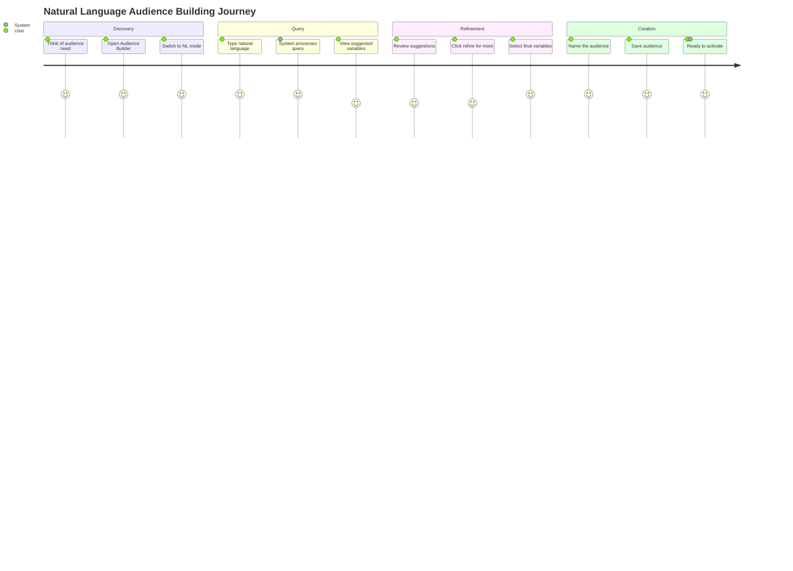
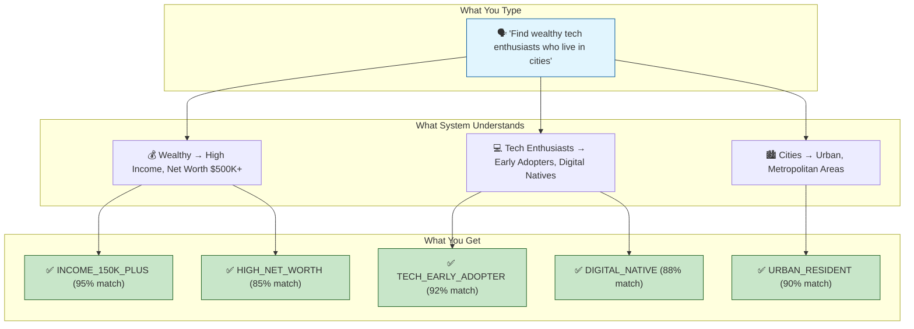
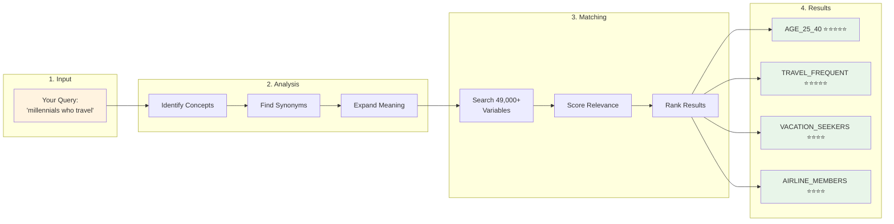
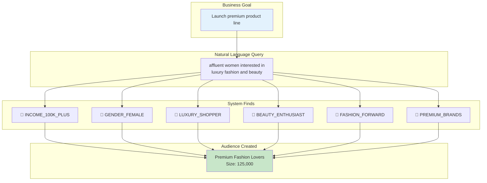
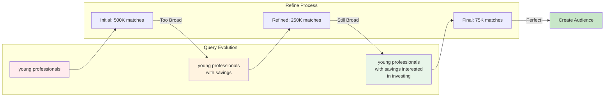
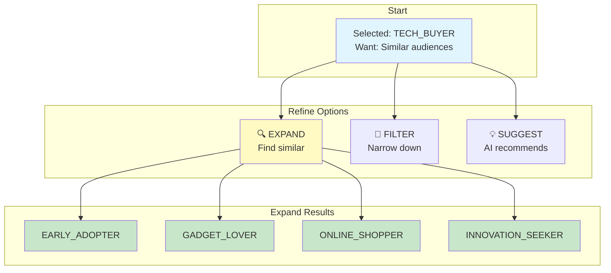
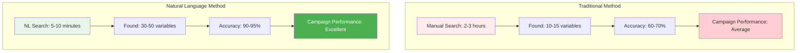
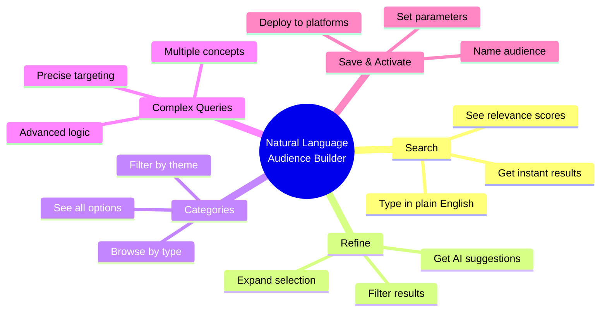
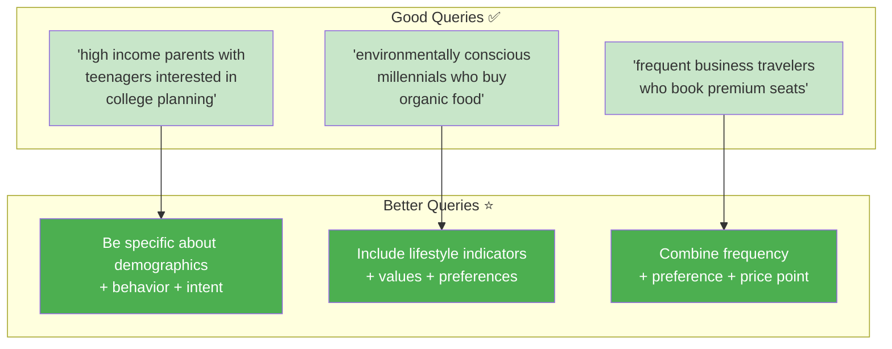

# Natural Language Audience Building - Visual Process Flow

## 🎯 The User Journey

## 📊 How Natural Language Processing Works

## 🔄 The Smart Matching Process

## 🎨 Real-World Examples

### Example 1: E-commerce Campaign

### Example 2: Financial Services

## 🚀 The Power of Refinement

## 📈 Business Impact Visualization

## 🎯 Quick Reference Card

## 💡 Pro Tips for Business Users

