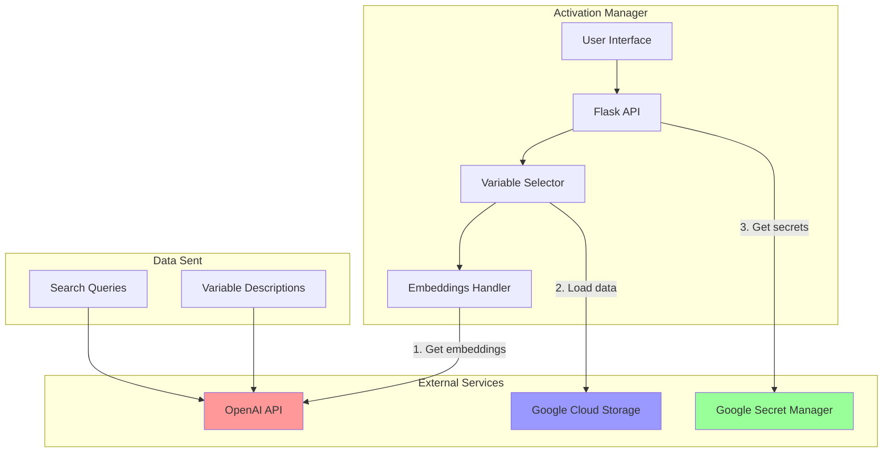

# Outbound API Calls Inventory - Activation Manager

## Executive Summary

The Activation Manager makes outbound calls to 4 primary external services:
1. **OpenAI API** - For embeddings and semantic search
2. **Google Cloud Services** - For storage and secrets
3. **NLWeb Integration** - Multiple LLM providers (in separate module)
4. **Legacy Anthropic API** - In archived code only

---

## 1. OpenAI API Calls

### Embeddings Generation
**Service**: OpenAI Embeddings API  
**Endpoint**: `embeddings.create`  
**Model**: `text-embedding-ada-002`  
**Frequency**: On-demand when users search

#### Code Example:
```python
# From /activation_manager/core/embeddings_handler.py (line 157-161)
response = openai_client.embeddings.create(
    model="text-embedding-ada-002",
    input=query
)
query_embedding = np.array(response.data[0].embedding).astype('float32')
```

#### Data Sent:
- User search queries (e.g., "high income millennials")
- Variable descriptions for embedding generation
- No PII or sensitive user data

#### Authentication:
```python
# Environment variable
OPENAI_API_KEY = os.environ.get('OPENAI_API_KEY')
```

#### Error Handling:
```python
try:
    response = openai_client.embeddings.create(...)
except Exception as e:
    logger.error(f"Error getting query embedding: {e}")
    return None  # Falls back to keyword search
```

#### Security Considerations:
- ⚠️ API key stored in environment variable (not encrypted)
- ✅ Errors handled gracefully with fallback
- ⚠️ No rate limiting implemented
- ⚠️ No cost monitoring

---

## 2. Google Cloud Services

### 2.1 Google Cloud Storage (GCS)
**Purpose**: Store and retrieve variable embeddings  
**Bucket**: `activation-manager-data`  
**Files Accessed**:
- `embeddings/variables_full.json`
- `embeddings/variable_ids_full.json`
- `embeddings/variable_embeddings_full.npy`

#### Code Example:
```python
# From /activation_manager/core/variable_selector.py (line 315-337)
client = storage.Client()
bucket = client.bucket("activation-manager-data")
blob = bucket.blob("embeddings/variables_full.json")
blob.download_to_filename(local_path)
```

#### Authentication:
- Uses Application Default Credentials (ADC)
- Service account: `feisty-catcher-461000-g2@appspot.gserviceaccount.com`

### 2.2 Google Secret Manager
**Purpose**: Retrieve API keys and secrets  
**Implementation**: Referenced but not actively used in main codebase

---

## 3. NLWeb Module Integration (Microsoft)

The NLWeb module (`/NLWeb/`) contains multiple LLM integrations:

### 3.1 LLM Providers
| Provider | File | Endpoint | Authentication |
|----------|------|----------|----------------|
| OpenAI | `/NLWeb/code/llm/openai.py` | `chat.completions.create` | API Key |
| Azure OpenAI | `/NLWeb/code/llm/azure_oai.py` | Azure endpoints | API Key + Endpoint |
| Anthropic | `/NLWeb/code/llm/anthropic.py` | Messages API | API Key |
| Google Gemini | `/NLWeb/code/llm/gemini.py` | GenerativeModel | API Key |
| Snowflake Cortex | `/NLWeb/code/llm/snowflake.py` | SQL queries | Connection string |

### 3.2 Embedding Services
- OpenAI Embeddings
- Azure OpenAI Embeddings  
- Snowflake Embeddings

### 3.3 Vector Databases
- **Qdrant**: Vector similarity search
- **Milvus**: Alternative vector DB
- **Azure Cognitive Search**: Search service

---

## 4. Data Flow Diagram



---

## 5. API Call Frequency & Volume

| Service | Estimated Calls/Day | Data Volume | Cost Impact |
|---------|-------------------|-------------|-------------|
| OpenAI Embeddings | 100-1000 | ~1KB per call | $0.0001/1K tokens |
| GCS Read | 10-50 | ~50MB on startup | $0.12/GB transfer |
| GCS Write | 0-5 | Minimal | $0.02/GB stored |

---

## 6. Security & Compliance Concerns

### Critical Issues:
1. **API Keys in Environment Variables** ❌
   - Not encrypted at rest
   - No key rotation policy
   - Visible in logs/debugging

2. **No Rate Limiting** ❌
   - Risk of API quota exhaustion
   - Potential cost overruns
   - No DDoS protection

3. **Limited Error Handling** ⚠️
   - Some APIs have try-catch
   - But errors may leak sensitive info
   - No circuit breakers

4. **No Audit Trail** ❌
   - API calls not logged
   - No usage monitoring
   - Can't track costs

### Data Privacy:
- ✅ No PII sent to external APIs
- ✅ Only search queries and variable descriptions
- ⚠️ Queries could reveal business intent
- ❌ No data residency controls

---

## 7. Recommendations

### Immediate Actions:
1. **Secure API Keys**
   ```python
   # Use Google Secret Manager instead
   from google.cloud import secretmanager
   client = secretmanager.SecretManagerServiceClient()
   api_key = client.access_secret_version(name=secret_path)
   ```

2. **Implement Rate Limiting**
   ```python
   from functools import wraps
   from time import time, sleep
   
   def rate_limit(calls_per_minute):
       # Rate limiting decorator
   ```

3. **Add Cost Monitoring**
   ```python
   # Track API usage
   api_usage = {
       'openai_embeddings': {'count': 0, 'cost': 0},
       'gcs_reads': {'count': 0, 'bytes': 0}
   }
   ```

4. **Implement Circuit Breaker**
   ```python
   class CircuitBreaker:
       def __init__(self, failure_threshold=5):
           self.failure_count = 0
           self.is_open = False
   ```

### Long-term Improvements:
1. **API Gateway**: Route all external calls through gateway
2. **Caching Layer**: Reduce API calls with intelligent caching
3. **Monitoring**: Implement comprehensive API monitoring
4. **Fallback Strategies**: Multiple providers for resilience
5. **Cost Optimization**: Batch operations where possible

---

## 8. Testing External Dependencies

```python
# Example health check for external services
def check_external_services():
    status = {
        'openai': check_openai_api(),
        'gcs': check_gcs_access(),
        'overall': 'healthy'
    }
    return status
```

---

## Summary

The Activation Manager has a relatively simple external API footprint, primarily relying on OpenAI for embeddings and Google Cloud for storage. However, there are significant security and operational improvements needed:

1. **Security**: Move from environment variables to proper secret management
2. **Reliability**: Add rate limiting and circuit breakers
3. **Monitoring**: Implement usage tracking and cost monitoring
4. **Compliance**: Add audit trails for all external API calls

The NLWeb module adds complexity with multiple LLM providers, but appears to be a separate concern that could be isolated or removed if needed.