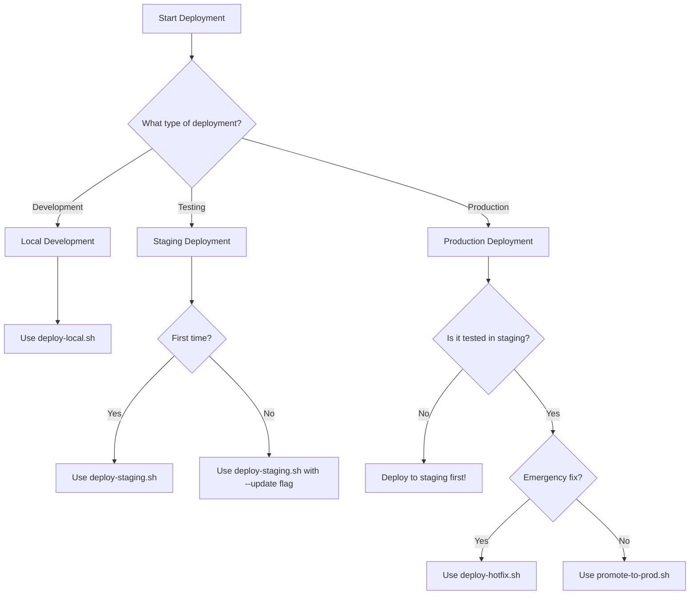

# Deployment Decision Tree

This guide helps you choose the right deployment approach for Activation Manager.

## 🎯 Quick Decision Flow



## 📋 Deployment Scenarios

### 1. Local Development
**When to use**: Testing changes on your machine
```bash
./scripts/deploy/deploy-local.sh
```

**What it does**:
- Builds frontend locally
- Runs backend with debug mode
- Uses local file paths
- No cloud resources needed

### 2. Staging Deployment
**When to use**: Testing changes before production

#### First-time staging deployment:
```bash
./deploy-staging.sh
```

**What it does**:
- Creates new staging version
- Builds optimized frontend
- Deploys to Google App Engine
- Version format: `stg-YYYYMMDD-HHMMSS`

#### Update existing staging:
```bash
./deploy-staging.sh --update
```

### 3. Production Deployment

#### Standard Production Release:
**When to use**: After staging tests pass
```bash
# First, verify staging
./test-staging.sh stg-20250530-154449

# Then promote to production
./promote-to-prod.sh stg-20250530-154449
```

#### Emergency Hotfix:
**When to use**: Critical production bugs
```bash
./deploy-hotfix.sh
```

**⚠️ Warning**: Hotfixes bypass staging. Use sparingly!

## 🔍 Which Script to Use?

| Scenario | Script | Example |
|----------|--------|---------|
| Local testing | `deploy-local.sh` | Testing new features |
| New feature to staging | `deploy-staging.sh` | Normal development |
| Bug fix to staging | `deploy-staging.sh` | Testing fixes |
| Staging → Production | `promote-to-prod.sh VERSION` | Release deployment |
| Emergency fix | `deploy-hotfix.sh` | Critical bugs only |
| Cost optimization | `deploy-cost-optimized.sh` | Reduce cloud costs |

## 📊 Deployment Checklist

### Before Staging:
- [ ] All tests pass locally
- [ ] Code reviewed and approved
- [ ] No console.log or debug statements
- [ ] Environment variables updated

### Before Production:
- [ ] Tested in staging for at least 24 hours
- [ ] Performance metrics acceptable
- [ ] No errors in staging logs
- [ ] Stakeholders notified

### After Deployment:
- [ ] Monitor logs for errors
- [ ] Verify key features work
- [ ] Check performance metrics
- [ ] Update deployment log

## 🚨 Common Issues

### Issue: "No module named 'activation_manager'"
**Solution**: Ensure Python path is set correctly
```bash
export PYTHONPATH="${PYTHONPATH}:/path/to/activation-manager"
```

### Issue: Frontend build fails
**Solution**: Clear cache and reinstall
```bash
rm -rf node_modules build
npm install
npm run build
```

### Issue: Deployment timeout
**Solution**: Use larger instance class
```yaml
# In app.yaml
instance_class: F2  # or F4 for more resources
```

## 📈 Monitoring Deployments

### View Logs:
```bash
# Staging logs
gcloud app logs tail --version=stg-YYYYMMDD-HHMMSS

# Production logs
gcloud app logs tail --service=default

# Filter for errors
gcloud app logs read --level=ERROR
```

### Check Version Status:
```bash
# List all versions
gcloud app versions list

# Check traffic split
gcloud app services describe default
```

## 🔄 Rollback Procedures

### Quick Rollback:
```bash
# Find previous version
gcloud app versions list --service=default

# Route traffic to previous version
gcloud app services set-traffic default \
  --splits=previous-version-id=100
```

### Full Rollback:
```bash
./scripts/deploy/rollback.sh previous-version-id
```

## 📝 Best Practices

1. **Always deploy to staging first**
2. **Wait at least 1 hour before promoting**
3. **Monitor logs during deployment**
4. **Have rollback plan ready**
5. **Document deployment in DEPLOYMENT_LOG.md**

## 🆘 Emergency Contacts

If deployment issues arise:
1. Check deployment logs
2. Review this guide
3. Check recent commits for changes
4. Contact team lead if critical

---

Remember: When in doubt, deploy to staging first!