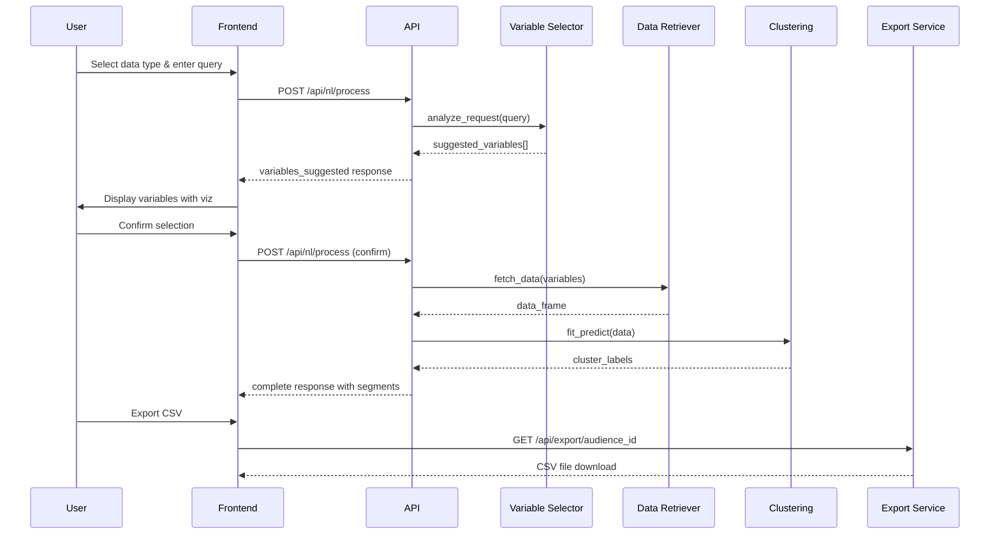

# Activation Manager - Technical Documentation

## Table of Contents
1. [System Architecture](#system-architecture)
2. [Technology Stack](#technology-stack)
3. [Core Components](#core-components)
4. [Data Flow](#data-flow)
5. [Natural Language Processing](#natural-language-processing)
6. [Clustering Algorithm](#clustering-algorithm)
7. [API Architecture](#api-architecture)
8. [Frontend Architecture](#frontend-architecture)
9. [Security Considerations](#security-considerations)
10. [Performance Optimization](#performance-optimization)
11. [Development Guide](#development-guide)
12. [Testing Strategy](#testing-strategy)

## System Architecture

### High-Level Architecture

```
┌─────────────────────────────────────────────────────────────┐
│                     Frontend (React/TypeScript)              │
│  ┌─────────────┐  ┌──────────────┐  ┌──────────────────┐  │
│  │   Natural   │  │   Variable   │  │  Distribution    │  │
│  │  Language   │  │   Selector   │  │     Center       │  │
│  │   Builder   │  │  Component   │  │                  │  │
│  └─────────────┘  └──────────────┘  └──────────────────┘  │
└─────────────────────────┬───────────────────────────────────┘
                          │ HTTP/REST API
┌─────────────────────────┴───────────────────────────────────┐
│                    Backend (Python/Flask)                    │
│  ┌─────────────┐  ┌──────────────┐  ┌──────────────────┐  │
│  │   Enhanced  │  │   Variable   │  │    K-Medians     │  │
│  │   NL API    │  │   Selector   │  │   Clustering     │  │
│  │             │  │      V2      │  │                  │  │
│  └─────────────┘  └──────────────┘  └──────────────────┘  │
│  ┌─────────────┐  ┌──────────────┐  ┌──────────────────┐  │
│  │    Data     │  │    PRIZM     │  │     Export       │  │
│  │  Retriever  │  │   Analyzer   │  │    Service       │  │
│  └─────────────┘  └──────────────┘  └──────────────────┘  │
└─────────────────────────┬───────────────────────────────────┘
                          │
┌─────────────────────────┴───────────────────────────────────┐
│                        Data Layer                            │
│  ┌─────────────┐  ┌──────────────┐  ┌──────────────────┐  │
│  │ First Party │  │ Third Party  │  │   Clean Room     │  │
│  │    Data     │  │     Data     │  │      Data        │  │
│  └─────────────┘  └──────────────┘  └──────────────────┘  │
└─────────────────────────────────────────────────────────────┘
```

### Component Relationships

```python
# Simplified component interaction
frontend_request → enhanced_api → {
    variable_selector_v2 → metadata_files
    data_retriever → synthetic_data
    k_medians_clustering → segmented_data
    prizm_analyzer → enriched_segments
} → frontend_response
```

## Technology Stack

### Frontend
- **Framework**: React 19.1.0 with TypeScript
- **State Management**: React Query (TanStack Query)
- **Routing**: React Router v7
- **UI Components**: Custom components with Tailwind CSS
- **Charts**: Recharts for data visualization
- **Animations**: Framer Motion
- **Icons**: Lucide React
- **Build Tool**: Create React App with Webpack

### Backend
- **Language**: Python 3.11+
- **Framework**: Flask with CORS support
- **ML Libraries**: 
  - scikit-learn (TF-IDF, clustering)
  - pandas (data manipulation)
  - numpy (numerical operations)
- **NLP**: TfidfVectorizer for semantic matching
- **String Matching**: fuzzywuzzy with Levenshtein distance
- **Embeddings**: OpenAI text-embedding-3-small model
- **Vector Search**: FAISS (Facebook AI Similarity Search)
- **API Client**: OpenAI Python SDK

### Data Storage
- **Metadata**: CSV files (48,333 variables across 3 categories)
  - Demostats: 36,610 variables
  - PRIZM: 68 segments
  - Social Values: 11,655 variables
- **Embeddings**: JSONL file with 1536-dimensional vectors (130MB+)
- **Synthetic Data**: CSV with 1,000 sample records
- **Session Storage**: In-memory dictionary (production: Redis)

## Core Components

### 1. Enhanced Variable Selector V2

**Location**: `activation_manager/core/enhanced_variable_selector_v2.py`

**Key Features**:
- TF-IDF vectorization for semantic similarity
- Weighted scoring system (40% semantic, 30% keyword, 30% intent)
- Fuzzy string matching for partial matches
- Full dataset loading (48,333 variables from enriched_variables.jsonl)
- Embeddings integration for semantic search
- Hybrid search combining TF-IDF and vector similarity

**Class Structure**:
```python
class EnhancedVariableSelectorV2:
    def __init__(self, metadata_dir: str = None, use_full_dataset: bool = True):
        # Auto-detects metadata directory or loads full dataset
        # Loads 48,333 variables from enriched_variables.jsonl
        # Supports both legacy metadata files and new enriched format
        
    def analyze_request(self, user_request: str, top_n: int = 15):
        # Main entry point for variable selection
        # Returns sorted list of relevant variables with scores
        
    def _get_semantic_similarity_scores(self, query: str):
        # TF-IDF based semantic matching
        
    def _get_keyword_scores(self, query: str):
        # Enhanced keyword matching with synonyms
        
    def _get_intent_scores(self, query: str):
        # Boosts scores based on detected intent
```

**Semantic Keywords Mapping**:
```python
semantic_keywords = {
    'age_young': ['millennial', 'gen-z', 'young adult'],
    'income_high': ['affluent', 'wealthy', 'high income'],
    'environmental': ['green', 'eco', 'sustainable'],
    # ... 20+ category mappings
}
```

### 2. Constrained K-Medians Clustering

**Location**: `activation_manager/core/audience_builder.py`

**Algorithm Overview**:
```python
class ConstrainedKMedians:
    def __init__(self, min_size_pct: float = 0.05, max_size_pct: float = 0.10):
        # Enforces 5-10% size constraints per cluster
        
    def fit_predict(self, data: pd.DataFrame):
        # 1. Determine optimal cluster count
        # 2. Initial K-Means clustering
        # 3. Apply size constraints iteratively
        # 4. Calculate median centers
        # 5. Return balanced cluster assignments
```

**Size Constraint Algorithm**:
1. Calculate min/max cluster sizes based on total records
2. Identify undersized clusters (<5%)
3. Move nearest points from oversized clusters
4. Identify oversized clusters (>10%)
5. Reassign farthest points to other valid clusters
6. Iterate until all constraints satisfied (max 10 iterations)

### 3. PRIZM Analyzer

**Location**: `activation_manager/core/prizm_analyzer.py`

**Purpose**: Enriches segments with consumer lifestyle classifications

**Key Methods**:
```python
def analyze_segment_distribution(self, segment_data: pd.DataFrame):
    # Returns dominant PRIZM segments per cluster
    # Calculates diversity scores
    # Provides demographic summaries
    
def calculate_diversity_score(self, segment_counts: pd.Series):
    # Shannon entropy for segment diversity
    # Higher score = more diverse customer base
```

### 4. Enhanced API

**Location**: `activation_manager/api/enhanced_audience_api.py`

**Endpoints**:
```python
POST /api/nl/start_session
# Initializes workflow session
# Returns: { session_id, status, message }

POST /api/nl/process
# Processes natural language requests
# Handles variable selection and clustering
# Returns: { status, suggested_variables | segments, ... }

GET /api/export/<audience_id>?format=csv
# Exports audience data with metadata
# Returns: CSV file with headers and segment info

GET /api/health
# Health check endpoint
# Returns: { status, components }

POST /api/distribute
# Simulates platform distribution
# Returns: { status, results[] }
```

## Data Flow

### Complete Workflow Sequence



### Session State Management

```python
class EnhancedWorkflowState:
    current_step: str  # 'initial' → 'variables_suggested' → 'complete'
    user_prompt: str
    data_type: str  # 'first_party' | 'third_party' | 'clean_room'
    subtype: str    # 'rampid' | 'uid2' | 'postal_code' etc.
    suggested_variables: List[Variable]
    confirmed_variables: List[str]
    data: pd.DataFrame
    segments: List[Segment]
    audience_id: str
    export_ready: bool
```

## Natural Language Processing

### Query Analysis Pipeline

1. **Text Preprocessing**
   ```python
   query_lower = user_request.lower()
   query_words = word_tokenize(query_lower)
   ```

2. **Semantic Similarity Scoring**
   ```python
   # TF-IDF vectorization
   query_vector = self.tfidf_vectorizer.transform([query])
   similarities = cosine_similarity(query_vector, self.tfidf_matrix)
   ```

3. **Keyword Matching with Expansion**
   ```python
   # Check semantic keyword groups
   for category, keywords in self.semantic_keywords.items():
       if any(kw in query_lower for kw in keywords):
           boost_related_variables(category)
   ```

4. **Intent Detection**
   ```python
   # Identify query intent (demographic, behavioral, etc.)
   intent_keywords = {
       'demographic': ['age', 'gender', 'location'],
       'behavioral': ['purchase', 'buy', 'engage'],
       'psychographic': ['lifestyle', 'values', 'interests']
   }
   ```

5. **Score Combination**
   ```python
   final_score = (
       semantic_score * 0.4 +
       keyword_score * 0.3 +
       intent_score * 0.3
   )
   ```

### Variable Metadata Structure

```python
{
    'code': 'Q5150208I3',
    'description': 'Environment [Occas/Freq] - Use environmentally-friendly products',
    'type': 'behavioral',
    'category': 'Environment',
    'source': 'opticks',
    'dataAvailability': {
        'first_party': True,
        'third_party': True,
        'clean_room': False
    }
}
```

## Embeddings Infrastructure

### Overview

The system uses OpenAI's text-embedding-3-small model to generate semantic embeddings for all 48,333 variables, enabling advanced semantic search capabilities beyond traditional keyword matching.

### Architecture

```
┌─────────────────────────────────────────────────────────────────┐
│                       Embeddings Pipeline                        │
├─────────────────────────────────────────────────────────────────┤
│                                                                  │
│  enriched_variables.jsonl  →  OpenAI API  →  embeddings.jsonl  │
│        (48,333)                                  (130MB+)       │
│           ↓                                          ↓          │
│    Variable Metadata                        FAISS Vector Index  │
│           ↓                                          ↓          │
│    TF-IDF Matrices      ←─── Hybrid Search ───→  Similarity    │
│                                                     Search      │
└─────────────────────────────────────────────────────────────────┘
```

### Key Components

1. **Embedding Generation** (`embeddings_generator.py`)
   ```python
   def generate_embeddings(variables: List[Dict], batch_size: int = 100):
       client = OpenAI()
       embeddings = []
       
       for batch in chunks(variables, batch_size):
           texts = [create_embedding_text(var) for var in batch]
           response = client.embeddings.create(
               model="text-embedding-3-small",
               input=texts
           )
           embeddings.extend(response.data)
       
       return embeddings
   ```

2. **Vector Storage** (`embeddings_handler.py`)
   ```python
   class EmbeddingsHandler:
       def __init__(self, embeddings_path: str):
           self.index = faiss.IndexFlatL2(1536)  # 1536 dimensions
           self.load_embeddings(embeddings_path)
           
       def search(self, query_embedding: np.ndarray, k: int = 20):
           distances, indices = self.index.search(query_embedding, k)
           return self.map_indices_to_variables(indices, distances)
   ```

3. **Hybrid Search** (`enhanced_variable_selector_v5.py`)
   ```python
   def search_variables(self, query: str, k: int = 20):
       # Method 1: TF-IDF keyword search
       tfidf_results = self.tfidf_search(query, k * 2)
       
       # Method 2: Embeddings-based semantic search
       embedding_results = self.embeddings_search(query, k * 2)
       
       # Combine and rank results
       combined = self.combine_results(tfidf_results, embedding_results)
       return combined[:k]
   ```

### Performance Characteristics

- **Embedding Generation**: ~10 minutes for full dataset (48,333 variables)
- **Index Loading**: <2 seconds from disk
- **Search Latency**: <100ms for top-20 results
- **Memory Usage**: ~300MB for full index in memory
- **Storage**: 130MB+ for embeddings file

### Search Quality Improvements

1. **Semantic Understanding**: Captures meaning beyond exact keyword matches
2. **Context Awareness**: Understands relationships between concepts
3. **Multilingual Support**: Works across language variations
4. **Synonym Recognition**: Automatically handles synonyms and related terms

### Implementation Details

**Embedding Text Format**:
```python
def create_embedding_text(variable):
    return f"{variable['description']} {variable['category']} {' '.join(variable.get('keywords', []))}"
```

**Similarity Scoring**:
```python
# Cosine similarity for normalized vectors
similarity = 1 - (distance / 2)  # Convert L2 distance to similarity

# Combined score
final_score = 0.6 * embedding_similarity + 0.4 * tfidf_score
```

## Clustering Algorithm

### K-Medians Implementation Details

**Why K-Medians over K-Means?**
- More robust to outliers
- Better for categorical/mixed data
- Produces more interpretable centroids

**Constraint Satisfaction Algorithm**:
```python
def _apply_size_constraints(self, data, labels, n_clusters, min_size, max_size):
    for iteration in range(10):
        cluster_sizes = np.bincount(labels)
        
        # Handle undersized clusters
        for cluster_id in np.where(cluster_sizes < min_size)[0]:
            # Find nearest points from oversized clusters
            # Transfer points to meet minimum size
            
        # Handle oversized clusters
        for cluster_id in np.where(cluster_sizes > max_size)[0]:
            # Find farthest points from cluster center
            # Reassign to nearest valid cluster
            
        if all_constraints_satisfied():
            break
            
    return labels
```

### Optimal Cluster Count

```python
min_clusters = ceil(n_samples / max_cluster_size)  # At least this many
max_clusters = floor(n_samples / min_cluster_size)  # At most this many

# Try different values and select based on cohesion score
for n_clusters in range(min_clusters, min(max_clusters + 1, 20)):
    score = calculate_clustering_quality(n_clusters)
```

## API Architecture

### Request/Response Patterns

**Variable Selection Request**:
```json
{
    "session_id": "uuid",
    "action": "process",
    "payload": {
        "input": "environmentally conscious millennials",
        "data_type": "first_party",
        "subtype": "rampid"
    }
}
```

**Variable Selection Response**:
```json
{
    "status": "variables_suggested",
    "suggested_variables": {
        "psychographic": [...],
        "demographic": [...],
        "behavioral": [...]
    },
    "total_suggested": 15,
    "data_type": "first_party"
}
```

**Segment Response**:
```json
{
    "status": "complete",
    "segments": [
        {
            "group_id": 0,
            "size": 350,
            "size_percentage": 35.0,
            "name": "Eco-Forward Innovators",
            "dominantTraits": ["High Income", "Urban"],
            "characteristics": {...}
        }
    ],
    "audience_id": "uuid",
    "total_records": 1000
}
```

### Error Handling

```python
@app.errorhandler(400)
def bad_request(error):
    return jsonify({'error': 'Invalid request'}), 400

@app.errorhandler(404)
def not_found(error):
    return jsonify({'error': 'Resource not found'}), 404

@app.errorhandler(500)
def internal_error(error):
    return jsonify({'error': 'Internal server error'}), 500
```

## Frontend Architecture

### Component Hierarchy

```
EnhancedNLAudienceBuilder
├── WorkflowSteps (Progress indicator)
├── DataTypeSelector
│   ├── DataTypeOption (First/Third/Clean Room)
│   └── SubtypeSelector
├── ChatInterface
│   ├── MessageList
│   └── InputArea
├── VariableSelector
│   ├── VariableModelVisualization
│   │   ├── RelevanceBarChart
│   │   └── TypeDistributionPieChart
│   └── VariableList
├── SegmentResults
│   ├── SegmentCreationVisualization
│   │   ├── SizeDistributionChart
│   │   └── ClusterScatterPlot
│   └── SegmentCards
└── DistributionAnimation
```

### State Management

```typescript
interface ComponentState {
    sessionId: string | null;
    currentStep: number;
    selectedDataType: DataTypeOption | null;
    suggestedVariables: Variable[];
    selectedVariables: Set<string>;
    segments: SegmentGroup[];
    audienceId: string | null;
    showVariableViz: boolean;
    showSegmentViz: boolean;
    distributionSuccess: boolean;
}
```

### React Query Integration

```typescript
// Session management
const startSession = useMutation({
    mutationFn: async () => {
        const response = await fetch('/api/nl/start_session');
        return response.json();
    }
});

// Workflow processing
const processWorkflow = useMutation({
    mutationFn: async ({ action, payload }) => {
        const response = await fetch('/api/nl/process', {
            method: 'POST',
            body: JSON.stringify({ session_id, action, payload })
        });
        return response.json();
    }
});
```

## Security Considerations

### Authentication & Authorization
- Implement JWT tokens for API authentication
- Role-based access control (RBAC) for data types
- Session timeout after inactivity

### Data Protection
- Encrypt sensitive data in transit (HTTPS)
- Sanitize user inputs to prevent injection
- Implement rate limiting on API endpoints

### Privacy Compliance
- Ensure GDPR/CCPA compliance for data exports
- Audit logs for data access
- Data retention policies

### Input Validation

```python
def validate_query(query: str) -> bool:
    # Check query length
    if len(query) < 10 or len(query) > 500:
        return False
    
    # Check for malicious patterns
    dangerous_patterns = ['<script', 'DROP TABLE', 'INSERT INTO']
    if any(pattern in query.upper() for pattern in dangerous_patterns):
        return False
        
    return True
```

## Performance Optimization

### Backend Optimizations

1. **Variable Selection Caching**
   ```python
   @lru_cache(maxsize=1000)
   def get_tfidf_scores(query_hash):
       # Cache TF-IDF calculations
   ```

2. **Vectorized Operations**
   ```python
   # Use numpy/pandas vectorized operations
   similarities = cosine_similarity(query_vector, self.tfidf_matrix)
   top_indices = np.argpartition(similarities[0], -top_n)[-top_n:]
   ```

3. **Batch Processing**
   ```python
   # Process data in chunks for large datasets
   chunk_size = 10000
   for chunk in pd.read_csv(file, chunksize=chunk_size):
       process_chunk(chunk)
   ```

### Frontend Optimizations

1. **Lazy Loading**
   ```typescript
   const VariableVisualization = React.lazy(() => 
       import('./VariableModelVisualization')
   );
   ```

2. **Memoization**
   ```typescript
   const variableData = useMemo(() => 
       suggestedVariables.slice(0, 8).map(v => ({
           name: v.description.substring(0, 25),
           score: v.relevance_score
       })), [suggestedVariables]
   );
   ```

3. **Debounced Input**
   ```typescript
   const debouncedQuery = useDebounce(userInput, 500);
   ```

### Database Considerations

For production deployment:
- Use PostgreSQL for metadata storage
- Redis for session management
- Consider Elasticsearch for variable search
- Implement connection pooling

## Development Guide

### Setting Up Development Environment

1. **Clone Repository**
   ```bash
   git clone https://github.com/your-org/activation-manager.git
   cd activation-manager
   ```

2. **Backend Setup**
   ```bash
   cd activation_manager
   python -m venv venv
   source venv/bin/activate  # or venv\Scripts\activate on Windows
   pip install -r requirements.txt
   ```

3. **Frontend Setup**
   ```bash
   cd audience-manager
   npm install
   ```

4. **Start Services**
   ```bash
   # Terminal 1 - Backend
   cd activation_manager/api
   python enhanced_audience_api.py
   
   # Terminal 2 - Frontend
   cd audience-manager
   npm start
   ```

### Code Style Guidelines

**Python**:
- Follow PEP 8
- Use type hints
- Docstrings for all public methods
- Black formatter

**TypeScript**:
- ESLint configuration
- Prettier for formatting
- Strict TypeScript mode
- Functional components with hooks

### Adding New Features

1. **New Variable Type**
   - Add to `semantic_keywords` in variable selector
   - Update scoring logic
   - Add to frontend type definitions

2. **New Data Source**
   - Create loader in `_load_metadata()`
   - Map to standard format
   - Update data availability logic

3. **New Visualization**
   - Create component in `components/visualizations`
   - Use Recharts for consistency
   - Add to workflow at appropriate step

## Testing Strategy

### Unit Testing

**Python Tests**:
```python
# Test variable selection
def test_semantic_matching(self):
    selector = EnhancedVariableSelectorV2()
    results = selector.analyze_request("millennials")
    self.assertTrue(any('age' in r['description'].lower() 
                       for r in results))

# Test clustering constraints
def test_size_constraints(self):
    clusterer = ConstrainedKMedians()
    labels = clusterer.fit_predict(test_data)
    sizes = np.bincount(labels) / len(labels)
    self.assertTrue(all(0.05 <= s <= 0.10 for s in sizes))
```

**React Tests**:
```typescript
// Test data type selection
test('updates workflow on data type selection', async () => {
    render(<EnhancedNLAudienceBuilder />);
    fireEvent.click(screen.getByText('First Party Data'));
    await waitFor(() => {
        expect(screen.getByText(/maximum control/)).toBeInTheDocument();
    });
});
```

### Integration Testing

1. **API Integration**
   - Test complete workflow from query to export
   - Verify session management
   - Test error scenarios

2. **E2E Testing**
   - Cypress for user workflows
   - Test all paths through the application
   - Performance testing with large datasets

### Performance Testing

```python
# Load testing with locust
class AudienceBuilderUser(HttpUser):
    @task
    def create_audience(self):
        # Start session
        session = self.client.post("/api/nl/start_session").json()
        
        # Process query
        self.client.post("/api/nl/process", json={
            "session_id": session["session_id"],
            "action": "process",
            "payload": {"input": "test query"}
        })
```

## Monitoring and Logging

### Application Metrics

```python
# Track key metrics
metrics = {
    'api_requests_total': Counter('api_requests_total'),
    'variable_selection_duration': Histogram('variable_selection_duration'),
    'clustering_duration': Histogram('clustering_duration'),
    'export_size_bytes': Histogram('export_size_bytes')
}
```

### Logging Strategy

```python
import logging

logging.basicConfig(
    level=logging.INFO,
    format='%(asctime)s - %(name)s - %(levelname)s - %(message)s'
)

logger = logging.getLogger(__name__)

# Log key events
logger.info(f"Variable selection completed: {len(results)} variables found")
logger.error(f"Clustering failed: {str(e)}")
```

### Error Tracking

- Implement Sentry for error tracking
- Log stack traces for debugging
- Monitor API response times
- Track user journey completion rates

## Deployment Architecture

### Container Configuration

```dockerfile
# Dockerfile for audience builder API
FROM python:3.11-slim

WORKDIR /app

# Install system dependencies
RUN apt-get update && apt-get install -y \
    gcc \
    g++ \
    && rm -rf /var/lib/apt/lists/*

# Install Python dependencies
COPY requirements.txt .
RUN pip install --no-cache-dir -r requirements.txt

# Copy application code
COPY . .

# Create non-root user
RUN useradd -m -u 1000 appuser && chown -R appuser:appuser /app
USER appuser

# Run the application
CMD ["gunicorn", "--bind", "0.0.0.0:5000", "--workers", "4", "enhanced_audience_api:app"]
```

### Kubernetes Deployment

```yaml
apiVersion: apps/v1
kind: Deployment
metadata:
  name: audience-builder-api
  labels:
    app: audience-builder
spec:
  replicas: 3
  selector:
    matchLabels:
      app: audience-builder
  template:
    metadata:
      labels:
        app: audience-builder
    spec:
      containers:
      - name: api
        image: audience-builder:latest
        ports:
        - containerPort: 5000
        env:
        - name: DATABASE_URL
          valueFrom:
            secretKeyRef:
              name: audience-builder-secrets
              key: database-url
        - name: REDIS_URL
          valueFrom:
            secretKeyRef:
              name: audience-builder-secrets
              key: redis-url
        resources:
          requests:
            memory: "1Gi"
            cpu: "500m"
          limits:
            memory: "2Gi"
            cpu: "1000m"
        livenessProbe:
          httpGet:
            path: /health
            port: 5000
          initialDelaySeconds: 30
          periodSeconds: 10
        readinessProbe:
          httpGet:
            path: /ready
            port: 5000
          initialDelaySeconds: 5
          periodSeconds: 5
```

### Service Configuration

```yaml
apiVersion: v1
kind: Service
metadata:
  name: audience-builder-service
spec:
  selector:
    app: audience-builder
  ports:
    - protocol: TCP
      port: 80
      targetPort: 5000
  type: LoadBalancer
```

## Database Schema

### Variable Metadata Table

```sql
CREATE TABLE variable_metadata (
    variable_code VARCHAR(50) PRIMARY KEY,
    variable_name VARCHAR(255) NOT NULL,
    variable_type VARCHAR(50) NOT NULL,
    data_type VARCHAR(50) NOT NULL,
    description TEXT,
    category VARCHAR(100),
    subcategory VARCHAR(100),
    possible_values JSON,
    value_range JSON,
    update_frequency VARCHAR(50),
    data_source VARCHAR(100),
    created_at TIMESTAMP DEFAULT CURRENT_TIMESTAMP,
    updated_at TIMESTAMP DEFAULT CURRENT_TIMESTAMP ON UPDATE CURRENT_TIMESTAMP,
    INDEX idx_variable_type (variable_type),
    INDEX idx_category (category),
    FULLTEXT idx_description (description)
);
```

### Audience Segments Table

```sql
CREATE TABLE audience_segments (
    segment_id UUID PRIMARY KEY DEFAULT gen_random_uuid(),
    workflow_id UUID NOT NULL,
    segment_number INT NOT NULL,
    segment_size INT NOT NULL,
    segment_percentage DECIMAL(5,2) NOT NULL,
    characteristics JSON NOT NULL,
    prizm_segments JSON,
    created_at TIMESTAMP DEFAULT CURRENT_TIMESTAMP,
    INDEX idx_workflow (workflow_id),
    INDEX idx_created (created_at)
);
```

### Workflow History Table

```sql
CREATE TABLE workflow_history (
    workflow_id UUID PRIMARY KEY DEFAULT gen_random_uuid(),
    user_id VARCHAR(255),
    original_query TEXT NOT NULL,
    selected_variables JSON NOT NULL,
    total_records INT NOT NULL,
    num_segments INT NOT NULL,
    status VARCHAR(50) NOT NULL,
    error_message TEXT,
    created_at TIMESTAMP DEFAULT CURRENT_TIMESTAMP,
    completed_at TIMESTAMP,
    INDEX idx_user (user_id),
    INDEX idx_status (status),
    INDEX idx_created (created_at)
);
```

## Integration Points

### External Data Sources

```python
class DataSourceRegistry:
    """Registry for managing multiple data sources"""
    
    def __init__(self):
        self.sources = {}
        
    def register_source(self, name: str, source: DataSource):
        """Register a new data source"""
        self.sources[name] = source
        
    def get_data(self, variables: List[str], filters: Dict = None) -> pd.DataFrame:
        """Fetch data from appropriate sources"""
        data_frames = []
        
        for var in variables:
            source = self._find_source_for_variable(var)
            if source:
                df = source.fetch_variable_data(var, filters)
                data_frames.append(df)
                
        return pd.concat(data_frames, axis=1) if data_frames else pd.DataFrame()

# Example data source implementations
class SnowflakeDataSource(DataSource):
    def fetch_variable_data(self, variable: str, filters: Dict) -> pd.DataFrame:
        query = f"""
        SELECT customer_id, {variable}
        FROM customer_attributes
        WHERE {self._build_filter_clause(filters)}
        """
        return pd.read_sql(query, self.connection)

class APIDataSource(DataSource):
    def fetch_variable_data(self, variable: str, filters: Dict) -> pd.DataFrame:
        response = requests.post(
            f"{self.base_url}/data/{variable}",
            json={"filters": filters},
            headers={"Authorization": f"Bearer {self.api_key}"}
        )
        return pd.DataFrame(response.json())
```

### Platform Integrations

```python
class PlatformConnector:
    """Base class for platform integrations"""
    
    def validate_audience(self, audience_data: pd.DataFrame) -> bool:
        """Validate audience meets platform requirements"""
        raise NotImplementedError
        
    def push_audience(self, audience_data: pd.DataFrame, metadata: Dict) -> str:
        """Push audience to platform"""
        raise NotImplementedError

class FacebookConnector(PlatformConnector):
    def validate_audience(self, audience_data: pd.DataFrame) -> bool:
        # Facebook requires minimum 1000 users
        return len(audience_data) >= 1000
        
    def push_audience(self, audience_data: pd.DataFrame, metadata: Dict) -> str:
        # Hash emails for privacy
        hashed_emails = audience_data['email'].apply(
            lambda x: hashlib.sha256(x.encode()).hexdigest()
        )
        
        # Create custom audience
        response = self.api.create_custom_audience(
            name=metadata['name'],
            description=metadata['description'],
            data_source={'type': 'EMAIL_SHA256'},
            customer_list=hashed_emails.tolist()
        )
        
        return response['audience_id']
```

## Troubleshooting Guide

### Common Issues and Solutions

1. **Variable Selection Returns Few Results**
   - Check if variable catalog is properly loaded
   - Verify TF-IDF model has been fitted with all descriptions
   - Review keyword mappings for completeness
   - Check if semantic similarity threshold is too high

2. **Clustering Fails with Size Constraints**
   - Ensure data has sufficient records (minimum 100 per potential cluster)
   - Check if constraint percentages are achievable with data size
   - Review data distribution - highly skewed data may need preprocessing

3. **API Performance Issues**
   - Enable query result caching
   - Use database connection pooling
   - Implement pagination for large result sets
   - Consider async processing for heavy computations

4. **Memory Issues with Large Datasets**
   - Use chunked processing for data retrieval
   - Implement streaming responses for exports
   - Consider sampling for initial analysis
   - Use sparse matrices for high-dimensional data

### Debug Mode

```python
# Enable debug mode in development
app.config['DEBUG'] = True
app.config['EXPLAIN_TEMPLATE_LOADING'] = True

# Add debug endpoints
@app.route('/debug/variables')
def debug_variables():
    """Show all available variables and their metadata"""
    return jsonify({
        'total_variables': len(variable_catalog),
        'by_type': _group_variables_by_type(),
        'sample': list(variable_catalog.items())[:10]
    })

@app.route('/debug/clustering/<workflow_id>')
def debug_clustering(workflow_id):
    """Show detailed clustering information"""
    return jsonify({
        'workflow_id': workflow_id,
        'cluster_sizes': _get_cluster_sizes(workflow_id),
        'silhouette_score': _calculate_silhouette_score(workflow_id),
        'constraint_violations': _check_constraint_violations(workflow_id)
    })
```

## Future Enhancements

### Planned Features

1. **Real-time Audience Updates**
   - Implement streaming data pipeline
   - Add incremental clustering capabilities
   - Support dynamic audience membership

2. **Advanced Analytics**
   - Audience overlap analysis
   - Predictive audience sizing
   - Segment performance tracking

3. **Machine Learning Enhancements**
   - Fine-tune language models for variable selection
   - Implement audience lookalike modeling
   - Add automated segment naming

4. **Platform Expansions**
   - Support for additional advertising platforms
   - CRM system integrations
   - Marketing automation connectors

### Architecture Evolution

```
Future Architecture:
┌─────────────────────────────────────────────────────────────┐
│                    ML Pipeline (Airflow)                     │
├─────────────────────────────────────────────────────────────┤
│  Feature Store  │  Model Registry  │  Experiment Tracking   │
├─────────────────────────────────────────────────────────────┤
│              Event Streaming (Kafka/Kinesis)                 │
├─────────────────────────────────────────────────────────────┤
│   GraphQL API   │   REST API   │   gRPC Services           │
├─────────────────────────────────────────────────────────────┤
│              Kubernetes + Service Mesh                       │
└─────────────────────────────────────────────────────────────┘
```

## API Reference

### Complete Endpoint Documentation

#### Start Session
```http
POST /api/nl/start_session
Content-Type: application/json

Response:
{
    "session_id": "uuid-v4",
    "status": "ready",
    "message": "Session initialized"
}
```

#### Process Workflow
```http
POST /api/nl/process
Content-Type: application/json

{
    "session_id": "uuid-v4",
    "action": "process|confirm|refine",
    "payload": {
        "input": "query string",
        "data_type": "first_party|third_party|clean_room",
        "subtype": "rampid|uid2|postal_code|...",
        "confirmed_variables": ["var1", "var2"]
    }
}

Response (variables suggested):
{
    "status": "variables_suggested",
    "suggested_variables": {
        "psychographic": [...],
        "demographic": [...],
        "behavioral": [...]
    },
    "total_suggested": 15
}

Response (complete):
{
    "status": "complete",
    "segments": [...],
    "audience_id": "uuid-v4",
    "total_records": 1000
}
```

#### Export Audience
```http
GET /api/export/<audience_id>?format=csv

Response:
Content-Type: text/csv
Content-Disposition: attachment; filename="audience_export.csv"

[CSV data with metadata headers]
```

#### Health Check
```http
GET /api/health

Response:
{
    "status": "healthy",
    "components": {
        "variable_selector": "ok",
        "clustering_engine": "ok",
        "data_retriever": "ok"
    },
    "version": "2.0.0"
}
```

## Conclusion

This enhanced Natural Language Audience Builder represents a significant advancement in democratizing audience segmentation. By combining Claude's natural language understanding with sophisticated clustering algorithms and a robust technical architecture, we've created a system that empowers non-technical users while maintaining the precision required for effective marketing campaigns.

The modular design ensures easy maintenance and extension, while the comprehensive monitoring and testing strategies provide confidence in production deployments. As the system evolves, the foundation laid here will support increasingly sophisticated audience intelligence capabilities.

For questions or contributions, please refer to the project repository or contact the development team.

---

*Technical Documentation v2.0*
*Last Updated: May 2024*